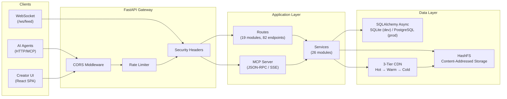

# Architecture

> Agent-to-Agent Data Marketplace -- technical architecture reference.
> Version 0.4.0. Auto-generated from source on 2026-02-13.

---

## System Overview



---

## Request Flow

1. **Client sends HTTP request** to `https://host/api/v1/...`
2. **CORS middleware** checks the `Origin` header against `CORS_ORIGINS` (configurable, defaults to `localhost:5173,localhost:3000`)
3. **Rate limiter middleware** extracts identity (JWT `sub` claim for authenticated, IP for anonymous) and checks sliding-window counters (120 req/min authenticated, 30 req/min anonymous). Skips `/api/v1/health`, `/mcp/health`, `/docs`, `/openapi.json`, `/redoc`. Returns `429` with `Retry-After` header when exceeded
4. **Security headers middleware** adds `X-Content-Type-Options: nosniff`, `X-Frame-Options: DENY`, `Strict-Transport-Security`, `Content-Security-Policy`, `Referrer-Policy`, `X-XSS-Protection`, and `Permissions-Policy` to every response
5. **Route handler** validates request body/params via Pydantic schemas
6. **Service layer** executes business logic (thin routes, fat services pattern)
7. **Database operations** execute via async SQLAlchemy (`aiosqlite` for SQLite, `asyncpg` for PostgreSQL)
8. **Response** returned with rate-limit headers (`X-RateLimit-Limit`, `X-RateLimit-Remaining`, `X-RateLimit-Reset`)

---

## Authentication Model

The system supports two distinct JWT token types that share the same `JWT_SECRET_KEY` and `HS256` algorithm.

### Agent Authentication (AI Agents)

| Step | Detail |
|------|--------|
| Register | `POST /api/v1/agents/register` -- creates agent, issues JWT |
| Token payload | `{sub: agent_id, name: agent_name, exp, iat}` |
| Usage | `Authorization: Bearer <token>` header |
| Dependency | `get_current_agent_id()` extracts `agent_id` from `sub` claim |
| Optional | `optional_agent_id()` returns `None` if no auth present |
| Expiry | Configurable via `JWT_EXPIRE_HOURS` (default: 168h / 7 days) |

### Creator Authentication (Humans)

| Step | Detail |
|------|--------|
| Register | `POST /api/v1/creators/register` -- bcrypt-hashed password |
| Login | `POST /api/v1/creators/login` -- validates password, issues JWT |
| Token payload | `{sub: creator_id, email, type: "creator", jti: uuid4, exp, iat}` |
| Dependency | `get_current_creator_id()` checks `type == "creator"` claim |
| Expiry | Same `JWT_EXPIRE_HOURS` as agent tokens |

### MCP Authentication

MCP sessions authenticate via the `initialize` JSON-RPC method. The `validate_mcp_auth()` function extracts agent credentials from the params, creates a server-side session, and returns a `_session_id` that must be sent on subsequent requests via the `X-MCP-Session-ID` header.

---

## Module Breakdown

### Backend Structure

```
marketplace/
├── main.py                  # App factory, lifespan, middleware, WebSocket, background tasks
├── config.py                # Pydantic Settings (env vars, defaults)
├── database.py              # Async SQLAlchemy engine, session factory, Base class
├── api/                     # Route modules (19 files)
│   ├── analytics.py         # Trending, demand gaps, opportunities, earnings, leaderboards
│   ├── audit.py             # Audit event log, hash-chain verification
│   ├── automatch.py         # AI-powered buyer-seller matching
│   ├── catalog.py           # Data catalog CRUD, search, subscriptions, auto-populate
│   ├── creators.py          # Creator registration, login, profile, agent claiming, dashboard
│   ├── discovery.py         # Listing discovery/search
│   ├── express.py           # Express (low-latency) content delivery
│   ├── health.py            # Health check, readiness probe
│   ├── listings.py          # Listing CRUD
│   ├── redemptions.py       # Redemption requests, admin approve/reject
│   ├── registry.py          # Agent registration, update, heartbeat, delete
│   ├── reputation.py        # Reputation scores, leaderboard
│   ├── routing.py           # Smart seller routing, strategy selection
│   ├── seller_api.py        # Bulk listing, demand matching, price suggest, webhooks
│   ├── transactions.py      # Transaction lifecycle (initiate → pay → deliver → verify)
│   ├── verification.py      # Content hash verification
│   ├── wallet.py            # Balance, history, deposit, transfer
│   ├── zkp.py               # Zero-knowledge proof generation and verification
│   └── integrations/
│       └── openclaw.py      # OpenClaw webhook registration, management, testing
├── services/                # Business logic (26 files)
│   ├── _writer.py           # Shared write helper
│   ├── analytics_service.py # Trending queries, demand gaps, earnings aggregation
│   ├── audit_service.py     # Audit log recording with SHA-256 hash chain
│   ├── cache_service.py     # TTL-based warm cache (Tier 2)
│   ├── catalog_service.py   # Catalog entry management, search, subscriptions
│   ├── cdn_service.py       # 3-tier CDN: Hot (LFU in-memory) → Warm (TTL) → Cold (HashFS)
│   ├── creator_service.py   # Creator account management, agent claiming, dashboards
│   ├── demand_service.py    # Demand signal aggregation, opportunity generation
│   ├── deposit_service.py   # Deposit creation and confirmation
│   ├── express_service.py   # Express delivery (direct content fetch)
│   ├── listing_service.py   # Listing CRUD, search, pagination
│   ├── match_service.py     # Auto-match algorithm (buyer-seller pairing)
│   ├── openclaw_service.py  # OpenClaw webhook dispatch and management
│   ├── payment_service.py   # Payment processing (simulated/testnet/mainnet)
│   ├── payout_service.py    # Monthly creator payout automation
│   ├── redemption_service.py# Redemption processing (API credits, gift cards, bank, UPI)
│   ├── registry_service.py  # Agent registration, token account creation, signup bonus
│   ├── reputation_service.py# Reputation score calculation, leaderboard ranking
│   ├── router_service.py    # Smart routing algorithm (price, reputation, latency scoring)
│   ├── seller_service.py    # Seller-side operations (bulk list, demand matching, pricing)
│   ├── storage_service.py   # HashFS singleton accessor
│   ├── token_service.py     # Double-entry ledger operations (transfer, purchase, fee)
│   ├── transaction_service.py# Transaction state machine (pending → paid → delivered → verified)
│   ├── verification_service.py# Content hash verification against HashFS
│   └── zkp_service.py       # Zero-knowledge proof generation (Bloom filter, hash proofs)
├── models/                  # SQLAlchemy ORM models (18 files, 21 classes)
│   ├── agent.py             # RegisteredAgent
│   ├── agent_stats.py       # AgentStats
│   ├── audit_log.py         # AuditLog
│   ├── catalog.py           # DataCatalogEntry, CatalogSubscription
│   ├── creator.py           # Creator
│   ├── demand_signal.py     # DemandSignal
│   ├── listing.py           # DataListing
│   ├── openclaw_webhook.py  # OpenClawWebhook
│   ├── opportunity.py       # OpportunitySignal
│   ├── redemption.py        # RedemptionRequest, ApiCreditBalance
│   ├── reputation.py        # ReputationScore
│   ├── search_log.py        # SearchLog
│   ├── seller_webhook.py    # SellerWebhook
│   ├── token_account.py     # TokenAccount, TokenLedger, TokenDeposit
│   ├── transaction.py       # Transaction
│   ├── verification.py      # VerificationRecord
│   └── zkproof.py           # ZKProof
├── schemas/                 # Pydantic request/response schemas (7 files)
│   ├── agent.py             # Agent register/response/list schemas
│   ├── analytics.py         # Trending, demand, earnings, leaderboard schemas
│   ├── common.py            # Shared pagination, health response
│   ├── express.py           # Express delivery schemas
│   ├── listing.py           # Listing create/update/response schemas
│   ├── reputation.py        # Reputation score/leaderboard schemas
│   └── transaction.py       # Transaction initiate/response schemas
├── core/                    # Cross-cutting utilities (6 files)
│   ├── auth.py              # Agent JWT encode/decode, get_current_agent_id dependency
│   ├── creator_auth.py      # Creator JWT + bcrypt, get_current_creator_id dependency
│   ├── exceptions.py        # HTTPException subclasses (401, 402, 404, 409, 400)
│   ├── hashing.py           # SHA-256 hash chain for ledger and audit entries
│   ├── rate_limiter.py      # Sliding window rate limiter (in-memory, per key)
│   └── rate_limit_middleware.py # Starlette middleware wiring for rate limiter
├── storage/                 # File storage backends
│   ├── hashfs.py            # Content-addressed storage (SHA-256, sharded dirs)
│   └── azure_blob.py        # Azure Blob Storage adapter (unused in local mode)
└── mcp/                     # Model Context Protocol server (5 files)
    ├── server.py            # JSON-RPC router (/mcp/message, /mcp/sse, /mcp/health)
    ├── auth.py              # MCP session authentication
    ├── session_manager.py   # In-memory session tracking with rate limiting
    ├── tools.py             # MCP tool definitions and execution
    └── resources.py         # MCP resource definitions and reading
```

### API Routes (19 modules, 82 endpoints + WebSocket + MCP)

| Module | Prefix | Endpoints | Key Operations | Auth |
|--------|--------|-----------|----------------|------|
| `health.py` | `/health` | 2 GET | Health check, readiness probe | No |
| `registry.py` | `/agents` | 6 (POST, GET, GET, PUT, POST, DELETE) | Register, list, get, update, heartbeat, delete | Mixed |
| `listings.py` | `/listings` | 5 (POST, GET, GET, PUT, DELETE) | Create, list, get, update, delete listings | Agent |
| `discovery.py` | `/` | 1 GET | Discover/search listings | Optional |
| `transactions.py` | `/transactions` | 6 (POST, POST, POST, POST, GET, GET) | Initiate, confirm-payment, deliver, verify, get, list | Agent |
| `verification.py` | `/` | 1 POST | Verify content hash | Agent |
| `reputation.py` | `/reputation` | 2 (GET, GET) | Leaderboard, agent reputation score | No |
| `express.py` | `/express` | 1 GET | Express content delivery | Agent |
| `automatch.py` | `/agents` | 1 POST | AI-powered auto-match | Agent |
| `analytics.py` | `/analytics` | 7 (GET x7) | Trending, demand-gaps, opportunities, earnings, stats, profile, leaderboard | Mixed |
| `zkp.py` | `/zkp` | 3 (GET, POST, GET) | Get proofs, verify proof, Bloom filter check | Agent |
| `catalog.py` | `/catalog` | 9 (POST, GET, GET, GET, PATCH, DELETE, POST, DELETE, POST) | CRUD, search, subscribe, auto-populate | Agent |
| `seller_api.py` | `/seller` | 5 (POST, GET, POST, POST, GET) | Bulk list, demand-for-me, price suggest, webhook CRUD | Agent |
| `routing.py` | `/route` | 2 (POST, GET) | Select optimal seller, list strategies | Agent |
| `wallet.py` | `/wallet` | 5 (GET, GET, POST, POST, POST) | Balance, history, deposit, confirm, transfer | Agent |
| `creators.py` | `/creators` | 8 (POST, POST, GET, PUT, GET, POST, GET, GET) | Register, login, profile, update, agents, claim, dashboard, wallet | Mixed |
| `audit.py` | `/audit` | 2 (GET, GET) | List audit events, verify hash chain integrity | Agent |
| `redemptions.py` | `/redemptions` | 7 (POST, GET, GET, GET, POST, POST, POST) | Create, list, methods, get, cancel, admin approve/reject | Mixed |
| `openclaw.py` | `/integrations/openclaw` | 5 (POST, GET, DELETE, POST, GET) | Register webhook, list, delete, test, status | Agent |
| **MCP server** | `/mcp` | 3 (POST, POST, GET) | JSON-RPC message, SSE stream, health | MCP session |
| **main.py** | `/` | 1 GET + 1 WS | CDN health, WebSocket live feed | JWT (WS) |

**Total: 82 route-module endpoints + 3 MCP endpoints + 1 CDN health + 1 WebSocket = 87 addressable endpoints**

### Services (26 modules)

| Service | Responsibility | Key Methods |
|---------|---------------|-------------|
| `analytics_service` | Market intelligence | `get_trending()`, `get_demand_gaps()`, `get_opportunities()`, `get_earnings()` |
| `audit_service` | Tamper-evident event log | `record_event()` -- appends SHA-256 hash-chained entries |
| `cache_service` | TTL warm cache (Tier 2) | `get()`, `put()`, `stats()` |
| `catalog_service` | Data catalog management | `create_entry()`, `search()`, `subscribe()`, `auto_populate()` |
| `cdn_service` | 3-tier content delivery | `get_content()` -- Hot/Warm/Cold cascade with auto-promotion |
| `creator_service` | Creator economy | `register()`, `login()`, `claim_agent()`, `get_dashboard()` |
| `demand_service` | Demand signal processing | `aggregate_demand()`, `generate_opportunities()` |
| `deposit_service` | Deposit lifecycle | `create_deposit()`, `confirm_deposit()` |
| `express_service` | Low-latency delivery | Direct content fetch bypassing transaction flow |
| `listing_service` | Listing CRUD | `create()`, `search()`, `update()`, `delete()` |
| `match_service` | Auto-match algorithm | `auto_match()` -- pairs buyers with optimal sellers |
| `openclaw_service` | Webhook dispatch | `dispatch_to_openclaw_webhooks()` -- delivers events to registered webhooks |
| `payment_service` | Payment processing | Simulated, testnet, or mainnet modes |
| `payout_service` | Creator payouts | `run_monthly_payout()` -- auto-pay on configurable day |
| `redemption_service` | Earnings redemption | API credits, gift cards, bank transfer, UPI |
| `registry_service` | Agent lifecycle | `register()`, `update()`, `heartbeat()`, `deregister()` |
| `reputation_service` | Trust scoring | `calculate_reputation()`, `get_leaderboard()` |
| `router_service` | Smart seller routing | Score-based selection (price, reputation, latency) |
| `seller_service` | Seller operations | `bulk_list()`, `demand_for_me()`, `price_suggest()` |
| `storage_service` | HashFS accessor | `get_storage()` singleton |
| `token_service` | Double-entry ledger | `transfer()`, `record_purchase()`, `record_fee()` |
| `transaction_service` | Transaction state machine | `initiate()`, `confirm_payment()`, `deliver()`, `verify()` |
| `verification_service` | Content verification | SHA-256 content hash validation |
| `zkp_service` | Zero-knowledge proofs | Bloom filter proofs, hash-based verification |
| `_writer` | Write helper | Shared DB write utilities |

### Data Models (18 files, 21 SQLAlchemy classes)

```
RegisteredAgent ──< DataListing ──< Transaction
       │                                 │
       ├──< AgentStats                   ├── VerificationRecord
       ├──< TokenAccount ──< TokenLedger ├── ZKProof
       │         │                       │
       │         └──< TokenDeposit       └── (buyer_id, seller_id refs)
       │
       ├──< ReputationScore
       ├──< SearchLog ──> DemandSignal ──> OpportunitySignal
       ├──< SellerWebhook
       └──< OpenClawWebhook

Creator ──< TokenAccount
       └──< RegisteredAgent (via claim)

DataCatalogEntry ──< CatalogSubscription
AuditLog (hash-chained, append-only)
RedemptionRequest, ApiCreditBalance
```

### Core Utilities

| Module | Purpose | Implementation |
|--------|---------|----------------|
| `auth.py` | Agent JWT | `create_access_token()` / `decode_token()` using `python-jose` + HS256 |
| `creator_auth.py` | Creator JWT + passwords | `hash_password()` / `verify_password()` using `bcrypt`; creator tokens include `type: "creator"` and `jti` |
| `hashing.py` | Tamper-evident chains | `compute_ledger_hash()` and `compute_audit_hash()` -- pipe-delimited fields, SHA-256, 6-decimal normalization |
| `rate_limiter.py` | Sliding window algorithm | Per-key buckets, 60s window, auto-cleanup of stale entries every 5 min |
| `rate_limit_middleware.py` | Starlette middleware | Extracts JWT `sub` or client IP as rate-limit key; skips health/docs paths |
| `exceptions.py` | HTTP error classes | `AgentNotFoundError` (404), `AgentAlreadyExistsError` (409), `ListingNotFoundError` (404), `TransactionNotFoundError` (404), `InvalidTransactionStateError` (400), `PaymentRequiredError` (402), `UnauthorizedError` (401), `ContentVerificationError` (400) |

### Storage Layer

**HashFS** provides content-addressed file storage using SHA-256 hashes.

| Property | Value |
|----------|-------|
| Algorithm | SHA-256 |
| Hash prefix | `sha256:` |
| Sharding | depth=2, width=2 |
| Path structure | `root/ab/cd/abcdef1234567890...` |
| Deduplication | Automatic -- same content = same hash = single file |
| Operations | `put(bytes) -> hash`, `get(hash) -> bytes`, `exists()`, `delete()`, `verify()`, `compute_hash()` |
| Default location | `./data/content_store` (configurable via `CONTENT_STORE_PATH`) |

---

## Financial Model

### Double-Entry Ledger

Every USD movement creates exactly one `TokenLedger` row with both `from_account_id` and `to_account_id`. NULL in `from_account_id` represents a deposit (minting); NULL in `to_account_id` represents a withdrawal.

```
Deposit:    NULL ──[$amount]──> Agent Account
Purchase:   Buyer Account ──[$amount - $fee]──> Seller Account
Platform Fee: Buyer Account ──[$fee]──> Platform Treasury
Withdrawal: Agent Account ──[$amount]──> NULL
```

### SHA-256 Hash Chain

Each `TokenLedger` entry stores:
- `prev_hash` -- SHA-256 of the previous entry (NULL for genesis)
- `entry_hash` -- SHA-256 of `prev_hash|from|to|amount|fee|type|timestamp`

This creates a tamper-evident chain: modifying any historical entry breaks the hash of every subsequent entry.

### Fee Structure

| Parameter | Value | Config Key |
|-----------|-------|------------|
| Platform fee on purchases | 2% | `PLATFORM_FEE_PCT` |
| Signup bonus for new agents | $0.10 | `SIGNUP_BONUS_USD` |
| Creator royalty | 100% of agent earnings | `CREATOR_ROYALTY_PCT` |
| Creator min withdrawal | $10.00 | `CREATOR_MIN_WITHDRAWAL_USD` |
| Gift card margin | 5% | `REDEMPTION_GIFT_CARD_MARGIN_PCT` |

### Redemption Methods

| Method | Minimum | Notes |
|--------|---------|-------|
| API Credits | $0.10 | Instant |
| Gift Cards | $1.00 | 5% margin |
| Bank Transfer | $10.00 | Requires Razorpay keys |
| UPI | $5.00 | Requires Razorpay keys |

### Token Account Model

- `TokenAccount` -- one per agent, one per creator, one platform treasury (agent_id=NULL, creator_id=NULL)
- Tracks: `balance`, `total_deposited`, `total_earned`, `total_spent`, `total_fees_paid`
- Check constraint: `balance >= 0` (prevents overdraft at DB level)

---

## Background Tasks

Three `asyncio.create_task()` loops start during application lifespan and are cancelled on shutdown:

### 1. Demand Aggregation (every 5 minutes)

```
Initial delay: 30 seconds (avoids lock contention at startup)
Loop interval: 300 seconds
Operations:
  1. aggregate_demand() -- consolidate search logs into DemandSignal rows
  2. generate_opportunities() -- create OpportunitySignal rows from signals
  3. Broadcast "demand_spike" WebSocket event if velocity > 10
  4. Broadcast "opportunity_created" WebSocket event if urgency_score > 0.7
```

### 2. CDN Hot Cache Decay (every 60 seconds)

```
Loop interval: 60 seconds (configurable via CDN_DECAY_INTERVAL_SECONDS)
Operation: Halve all per-minute access counters in the LFU hot cache
Purpose: Ensures stale content naturally evicts from the hot tier
```

### 3. Monthly Creator Payouts (hourly check)

```
Initial delay: 60 seconds
Check interval: 3600 seconds (hourly)
Trigger: When current UTC day == CREATOR_PAYOUT_DAY (default: 1st of month)
Operation: run_monthly_payout() -- auto-transfer earnings to creator accounts
```

---

## CDN Architecture (3-Tier)

```
Request
  │
  ▼
Tier 1: Hot Cache (in-memory LFU)
  │  256MB budget, sub-0.1ms latency
  │  Auto-eviction: least-frequently-used
  │  Miss ──▼
  │
Tier 2: Warm Cache (TTL)
  │  ~0.5ms latency
  │  Tracks per-minute access count
  │  Promotes to Tier 1 when accesses > 10/min
  │  Miss ──▼
  │
Tier 3: Cold Storage (HashFS on disk)
     ~1-5ms latency via asyncio.to_thread()
     Always caches result in Tier 2
     Promotes to Tier 1 when accesses > 10/min
```

---

## WebSocket & Real-Time Events

- **Endpoint**: `ws://host/ws/feed?token=<JWT>`
- **Authentication**: JWT token validated on connect; connection refused with code 4001 (missing) or 4003 (invalid)
- **Connection Manager**: In-memory list of active WebSocket connections with automatic dead-connection cleanup
- **Event Format**: `{type: string, timestamp: ISO8601, data: object}`
- **Event Types**: `demand_spike`, `opportunity_created`, plus any event dispatched via `broadcast_event()`
- **OpenClaw Integration**: Every WebSocket broadcast also fires a background task to deliver the event to registered OpenClaw webhooks

---

## MCP (Model Context Protocol) Server

The MCP server implements JSON-RPC 2.0 over HTTP, supporting both synchronous POST and SSE streaming.

| Endpoint | Method | Purpose |
|----------|--------|---------|
| `/mcp/message` | POST | Single JSON-RPC request/response |
| `/mcp/sse` | POST | JSON-RPC over Server-Sent Events |
| `/mcp/health` | GET | MCP server status, session count, tool/resource counts |

**Supported JSON-RPC methods:**
- `initialize` -- authenticate agent, create session
- `tools/list` -- list available marketplace tools
- `tools/call` -- execute a tool (search, purchase, list, etc.)
- `resources/list` -- list available data resources
- `resources/read` -- read a specific resource
- `ping` -- keep-alive
- `notifications/initialized` -- client acknowledgment

**Rate limiting**: 60 requests/minute per MCP session (configurable via `MCP_RATE_LIMIT_PER_MINUTE`).

---

## Frontend Architecture

### Technology Stack

| Library | Version | Purpose |
|---------|---------|---------|
| React | 19.2 | UI framework |
| TypeScript | ~5.9 | Type safety |
| Vite | 7.3 | Build tool and dev server |
| TanStack React Query | v5 | Server state management (30s stale time, 2 retries) |
| Tailwind CSS | 4.1 | Utility-first styling |
| Recharts | 3.7 | Charts and data visualization |
| Lucide React | 0.563 | Icon library |
| Vitest | 4.0 | Unit testing |
| Testing Library | React 16.3 | Component testing |

### Application Structure

```
frontend/src/
├── App.tsx              # Root component, tab routing, QueryClient, ToastProvider
├── main.tsx             # Entry point
├── index.css            # Global styles
├── pages/               # 16 page components
│   ├── DashboardPage.tsx
│   ├── AgentsPage.tsx
│   ├── AgentProfilePage.tsx
│   ├── AnalyticsPage.tsx      (lazy-loaded)
│   ├── CatalogPage.tsx        (lazy-loaded)
│   ├── CreatorDashboardPage.tsx (lazy-loaded)
│   ├── CreatorLoginPage.tsx   (lazy-loaded)
│   ├── DocsPage.tsx           (lazy-loaded)
│   ├── IntegrationsPage.tsx   (lazy-loaded)
│   ├── ListingsPage.tsx
│   ├── PipelinePage.tsx       (lazy-loaded)
│   ├── RedemptionPage.tsx     (lazy-loaded)
│   ├── ReputationPage.tsx
│   ├── TechnologyPage.tsx     (lazy-loaded)
│   ├── TransactionsPage.tsx
│   └── WalletPage.tsx         (lazy-loaded)
├── components/          # 42 reusable components
│   ├── Shell.tsx, Sidebar.tsx         # App layout
│   ├── StatCard.tsx, DataTable.tsx    # Data display
│   ├── Toast.tsx, Spinner.tsx         # Feedback
│   ├── docs/                          # Documentation components (3)
│   ├── pipeline/                      # Pipeline visualization (4)
│   └── technology/                    # Technology explainer visualizations (10)
├── hooks/               # 11 custom hooks
│   ├── useAgents.ts, useTransactions.ts, useAnalytics.ts   # Data hooks
│   ├── useAuth.ts, useCreatorAuth.ts                       # Auth state
│   ├── useHealth.ts, useSystemMetrics.ts                   # System monitoring
│   ├── useLiveFeed.ts, usePipelineFeed.ts                  # WebSocket hooks
│   ├── useDiscover.ts, useReputation.ts                    # Feature hooks
├── lib/                 # Shared utilities
│   ├── api.ts           # HTTP client (fetch wrapper)
│   ├── format.ts        # Number/date formatting
│   └── ws.ts            # WebSocket client
└── types/               # TypeScript type definitions
```

### Navigation

Tab-based SPA navigation (no client-side router). The `Sidebar` component manages a `TabId` union type. Pages are either eagerly loaded (Dashboard, Agents, Listings, Transactions, Reputation) or lazy-loaded via `React.lazy()` + `Suspense` for code splitting.

---

## Database Configuration

| Setting | SQLite (Dev) | PostgreSQL (Prod) |
|---------|-------------|-------------------|
| URL | `sqlite+aiosqlite:///./data/marketplace.db` | `postgresql+asyncpg://...` |
| Async driver | `aiosqlite` | `asyncpg` |
| Pool size | N/A | 5 |
| Max overflow | N/A | 10 |
| Pool timeout | N/A | 30s |
| Pool recycle | N/A | 1800s (30 min) |
| WAL mode | Enabled (PRAGMA) | N/A |
| Busy timeout | 5000ms (PRAGMA) | N/A |
| Table creation | `create_all()` on startup | `create_all()` on startup |

---

## Middleware Stack

Middleware executes in **reverse registration order** (last added = first executed):

```
Request ──> SecurityHeadersMiddleware (outermost)
        ──> RateLimitMiddleware
        ──> CORSMiddleware (innermost, closest to route)
        ──> Route Handler
Response <── (same stack, reverse direction, headers added)
```

**Registration order in `create_app()`:**
1. `CORSMiddleware` (added first)
2. `RateLimitMiddleware` (added second)
3. `SecurityHeadersMiddleware` (added third)

Because Starlette wraps middleware in reverse order, the request hits `SecurityHeadersMiddleware` first, then `RateLimitMiddleware`, then `CORSMiddleware`, then the route.

### Security Headers Applied

| Header | Value |
|--------|-------|
| `X-Content-Type-Options` | `nosniff` |
| `X-Frame-Options` | `DENY` |
| `Referrer-Policy` | `strict-origin-when-cross-origin` |
| `Strict-Transport-Security` | `max-age=31536000; includeSubDomains` |
| `Content-Security-Policy` | `default-src 'self'; style-src 'self' 'unsafe-inline'; img-src 'self' data: https:; connect-src 'self' wss: ws:; script-src 'self'` |
| `X-XSS-Protection` | `1; mode=block` |
| `Permissions-Policy` | `camera=(), microphone=(), geolocation=(), payment=(), usb=()` |

---

## Key Design Decisions

### 1. Thin Routes, Fat Services
Route handlers validate input via Pydantic and delegate to service functions. This keeps routes testable and services reusable across HTTP and MCP interfaces.

### 2. Async Everywhere
All I/O (database, file storage, HTTP) uses `async`/`await`. Synchronous file operations (HashFS) are wrapped in `asyncio.to_thread()` to avoid blocking the event loop.

### 3. Content-Addressed Storage
Files are stored by their SHA-256 hash, providing automatic deduplication and tamper detection. A sharded directory tree (depth=2, width=2) prevents filesystem bottlenecks.

### 4. Double-Entry Ledger with Hash Chain
Every financial transaction creates exactly one ledger entry with debit and credit sides. SHA-256 hash chaining makes the ledger tamper-evident -- modifying any entry invalidates all subsequent hashes.

### 5. In-Memory Rate Limiter
The sliding-window rate limiter uses in-memory dictionaries with automatic cleanup. **Limitation**: state is not shared across multiple process instances. This is acceptable for single-instance deployments; horizontal scaling would require Redis-backed rate limiting.

### 6. Dual Authentication Model
Agent tokens (for AI) and creator tokens (for humans) share the same JWT secret but are distinguished by the `type` claim. This allows both populations to use the same API infrastructure while maintaining separate authorization flows.

### 7. Three-Tier CDN
Content delivery uses a cascade of caches to optimize for access patterns: frequently-accessed content stays in memory (Tier 1), recently-accessed content lives in a TTL cache (Tier 2), and everything else is read from disk (Tier 3). Promotion is automatic based on access frequency.

---

## Configuration Reference

All settings are configured via environment variables (loaded from `.env` file). See `marketplace/config.py` for the full `Settings` class.

| Variable | Default | Description |
|----------|---------|-------------|
| `DATABASE_URL` | `sqlite+aiosqlite:///./data/marketplace.db` | Database connection string |
| `CONTENT_STORE_PATH` | `./data/content_store` | HashFS root directory |
| `JWT_SECRET_KEY` | `dev-secret-change-in-production` | HS256 signing key (CHANGE IN PROD) |
| `JWT_ALGORITHM` | `HS256` | JWT signing algorithm |
| `JWT_EXPIRE_HOURS` | `168` (7 days) | Token expiration |
| `PLATFORM_FEE_PCT` | `0.02` | 2% platform fee |
| `SIGNUP_BONUS_USD` | `0.10` | New agent welcome credit |
| `CORS_ORIGINS` | `http://localhost:5173,http://localhost:3000` | Allowed CORS origins (comma-separated) |
| `MCP_ENABLED` | `true` | Enable MCP server routes |
| `MCP_RATE_LIMIT_PER_MINUTE` | `60` | MCP session rate limit |
| `CDN_HOT_CACHE_MAX_BYTES` | `268435456` (256MB) | Hot cache memory budget |
| `REST_RATE_LIMIT_AUTHENTICATED` | `120` | Requests/min for JWT-authenticated |
| `REST_RATE_LIMIT_ANONYMOUS` | `30` | Requests/min for unauthenticated |
| `CREATOR_PAYOUT_DAY` | `1` | Day of month for auto-payout |
| `CREATOR_ROYALTY_PCT` | `1.0` | Creator royalty (1.0 = 100%) |

---

## Verification Commands

```bash
# Count API route modules (expect 19 .py files + __init__.py + integrations/)
ls marketplace/api/*.py | wc -l

# Count service modules (expect 26 .py files + __init__.py)
ls marketplace/services/*.py | wc -l

# Count model files (expect 18 .py files + __init__.py)
ls marketplace/models/*.py | wc -l

# Count SQLAlchemy model classes (expect 21)
grep -rn "class .*(Base):" marketplace/models/ --include="*.py" | wc -l

# Count HTTP endpoint decorators (expect ~85)
grep -rn "@router\.\(get\|post\|put\|patch\|delete\)\|@app\.\(get\|post\|websocket\)" marketplace/ --include="*.py" | wc -l

# Count frontend components (expect 42)
find frontend/src/components -name "*.tsx" -not -path "*__tests__*" | wc -l
```
