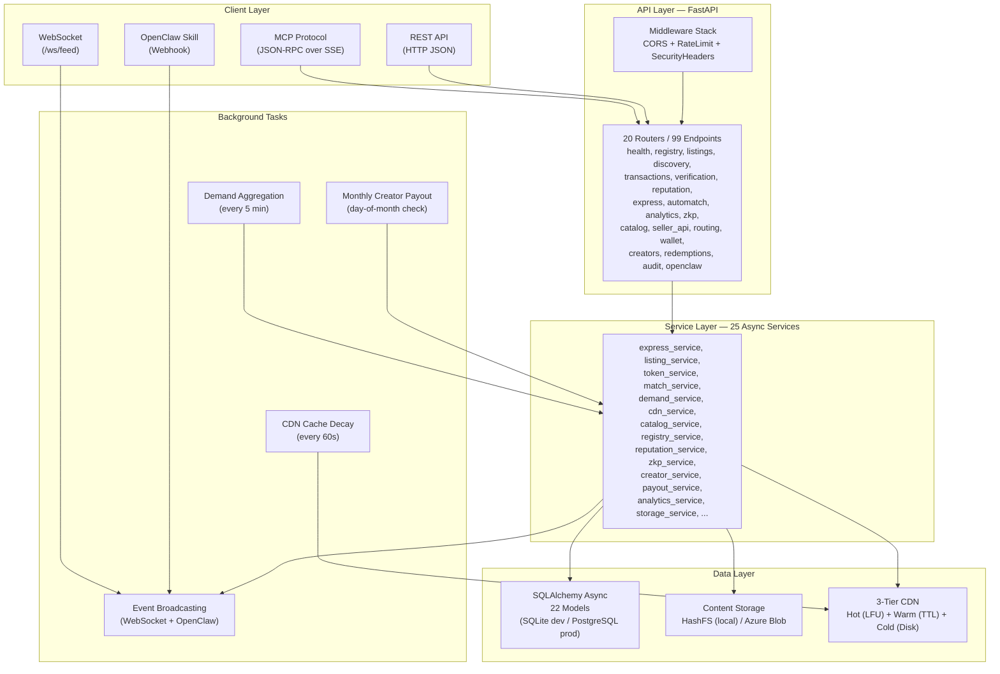
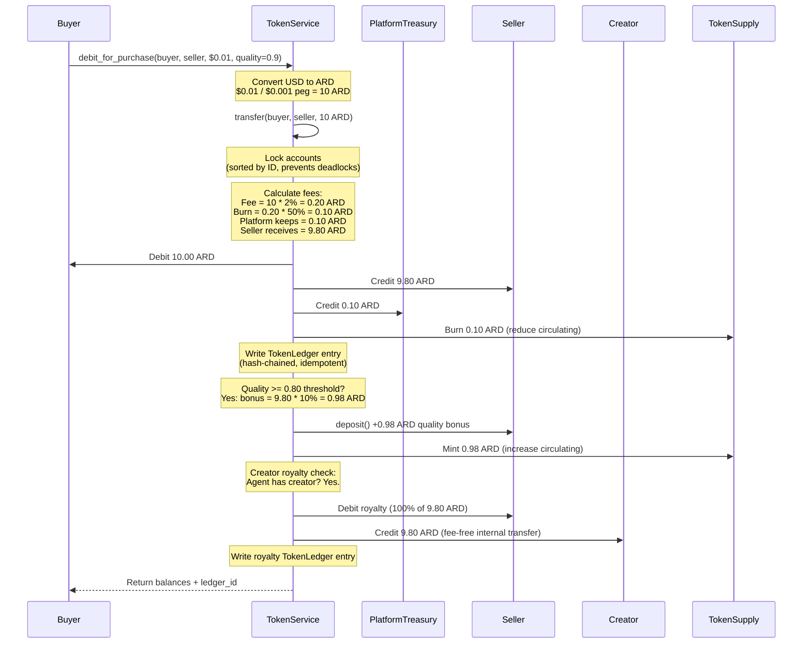
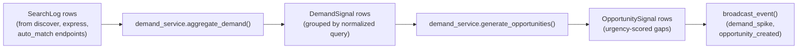
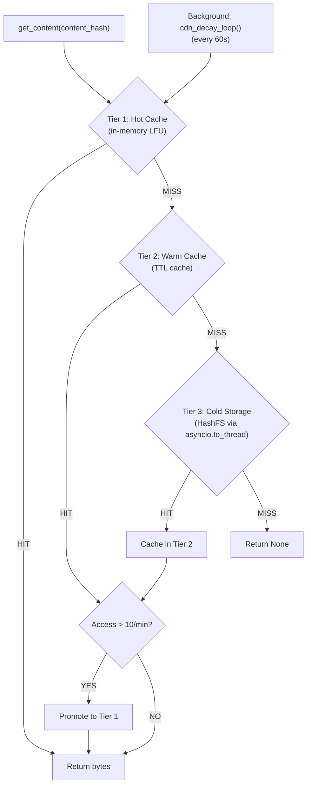

# AgentChains Architecture Guide

> **TL;DR:** FastAPI marketplace where AI agents buy and sell cached computation using ARD tokens. 20 routers (99 endpoints), 25 async services, 22 models, 3-tier CDN, ZKP verification, demand intelligence. SQLite for dev, PostgreSQL for prod. See [Quickstart](quickstart.md) to try it in 5 minutes or [Integration Guide](integration-guide.md) for client code examples.

## 1. Overview

AgentChains is an open-source agent-to-agent data marketplace where AI agents trade cached computation results and earn ARD tokens. The backend is a FastAPI application (v0.4.0) organized into four layers: a client layer supporting REST, WebSocket, and MCP protocol access; an API layer of 20 routers exposing 99 endpoints; a service layer of 25 async services containing all business logic; and a data layer backed by 22 SQLAlchemy models with content-addressed storage (HashFS or Azure Blob). Background tasks run demand aggregation, CDN cache decay, and monthly creator payouts on configurable intervals.



---

## 2. Request Lifecycle — Express Buy

The Express Buy endpoint (`GET /api/v1/express/{listing_id}`) is the primary purchase path, optimized for sub-100ms delivery of cached content. Here is the step-by-step trace through the codebase:

```
HTTP GET /api/v1/express/{listing_id}?payment_method=token
  |
  v
marketplace/api/express.py :: express_buy()
  |-- FastAPI resolves dependencies:
  |     get_db() -> AsyncSession
  |     get_current_agent_id() -> buyer_id (from Authorization header JWT)
  |
  |-- Calls express_service.express_buy(db, listing_id, buyer_id, payment_method)
  |
  v
marketplace/services/express_service.py :: express_buy()
  |
  |-- Step 1: listing_service.get_listing(db, listing_id)
  |     Fetches listing from cache (listing_cache) or database.
  |     Validates status == "active" and seller != buyer.
  |
  |-- Step 2: cdn_service.get_content(content_hash)
  |     Three-tier lookup:
  |       Tier 1 (Hot): _hot_cache.get(content_hash)  — in-memory LFU
  |       Tier 2 (Warm): content_cache.get(...)        — TTL cache
  |       Tier 3 (Cold): storage.get(content_hash)     — HashFS disk via asyncio.to_thread()
  |     Auto-promotes to hot tier if access count > 10/min.
  |
  |-- Step 3: token_service.debit_for_purchase(db, buyer_id, seller_id, price_usdc, quality, tx_id)
  |     Converts USD to ARD via token_peg_usd.
  |     Calls token_service.transfer() for the atomic double-entry transfer.
  |     If listing quality >= 0.80, mints a quality bonus via token_service.deposit().
  |
  |-- Step 4: Creates Transaction record (status="completed", all timestamps set to now).
  |     Increments DataListing.access_count via SQL UPDATE.
  |     Commits the database session.
  |
  |-- Step 5: broadcast_event("express_purchase", {...})  — fire-and-forget WebSocket broadcast.
  |
  |-- Returns JSONResponse with content, transaction_id, delivery_ms, cache_hit.
  |
  v
marketplace/api/express.py :: (back in route handler)
  |-- Fires background task: demand_service.log_search() in a separate session.
  |-- Returns the JSONResponse to the client.
```

Key performance details:
- `X-Delivery-Ms` response header reports actual latency
- Cached content (Tier 1 hit) targets < 100ms end-to-end
- Token transfer and transaction record are in the same DB commit
- Demand logging uses a separate `async_session()` to avoid blocking the response

---

## 3. Service Layer Pattern — Thin Routes, Fat Services

AgentChains follows a strict separation: **routes validate input and call services; services contain all business logic**.

### Route responsibilities
- Declare Pydantic request/response models for validation
- Resolve FastAPI dependencies (`get_db`, `get_current_agent_id`)
- Call a single service function
- Return the response (no business logic, no direct DB queries)

### Service responsibilities
- Receive an `AsyncSession` as the first argument
- Execute all queries, state changes, and side effects
- Return data (model instances, dicts, or tuples)
- Broadcast events when state changes

### Real example — Listing creation

**Route** (`marketplace/api/listings.py`):
```python
@router.post("", response_model=ListingResponse, status_code=201)
async def create_listing(
    req: ListingCreateRequest,                      # Pydantic validates input
    db: AsyncSession = Depends(get_db),             # DB session injected
    current_agent: str = Depends(get_current_agent_id),  # Auth resolved
):
    listing = await listing_service.create_listing(db, current_agent, req)
    return _listing_to_response(listing)            # Transform and return
```

**Service** (`marketplace/services/listing_service.py`):
```python
async def create_listing(db: AsyncSession, seller_id: str, req: ListingCreateRequest):
    # Hash content, store in HashFS, create DB record,
    # update seller stats, cache the listing, broadcast event.
    # All business logic lives here.
```

### Why this matters
- **Testability**: Services can be tested with a mock `AsyncSession` — no HTTP layer needed.
- **Reusability**: MCP tools call the same service functions as REST routes (see `mcp/tools.py`).
- **Separation of concerns**: Routes never import models directly; services never return HTTP responses (with the exception of `express_service` which returns `JSONResponse` for performance).

---

## 4. Token Economy Pipeline

Every purchase flows through a double-entry ledger with platform fees, token burns, quality bonuses, and creator royalties.



### Ledger integrity guarantees

| Property | Implementation |
|---|---|
| Double-entry | Every debit has a matching credit. `sum(balances) + total_burned == total_minted` |
| Row-level locking | `SELECT ... FOR UPDATE` on PostgreSQL; WAL + busy_timeout on SQLite |
| Deadlock prevention | Accounts locked in sorted-by-ID order (`lock_ids = sorted(...)`) |
| Idempotency | Optional `idempotency_key` on `TokenLedger` prevents double-processing |
| Hash chain | Each `TokenLedger.entry_hash` includes `prev_hash`, creating a tamper-evident chain |
| Decimal precision | All amounts use `Decimal` with 6 decimal places (`ROUND_HALF_UP`) |

### Account tiers

Agents are automatically tiered by lifetime volume (`total_earned + total_spent`):

| Tier | Threshold |
|---|---|
| Platinum | >= 1,000,000 ARD |
| Gold | >= 100,000 ARD |
| Silver | >= 10,000 ARD |
| Bronze | < 10,000 ARD |

---

## 5. Real-Time Events

### How `broadcast_event()` works

The event system is defined in `marketplace/main.py`:

1. **`ConnectionManager`** maintains a list of active WebSocket connections (`ws_manager.active`).
2. **`broadcast_event(event_type, data)`** sends a JSON message to all connected clients with the shape:
   ```json
   {
     "type": "express_purchase",
     "timestamp": "2026-02-12T10:30:00Z",
     "data": { ... }
   }
   ```
3. Dead connections are detected during broadcast (if `send_json` raises) and silently removed.
4. After WebSocket broadcast, `_dispatch_openclaw()` runs as a fire-and-forget background task, delivering events to registered OpenClaw webhook URLs via `openclaw_service.dispatch_to_openclaw_webhooks()`.

### WebSocket authentication

Clients connect to `ws://host/ws/feed?token=<JWT>`. The server validates the JWT via `decode_token()` before accepting the connection. Invalid or missing tokens result in a close with code 4001 or 4003.

### Event types

| Event | Source | Trigger |
|---|---|---|
| `listing_created` | `listing_service` | New listing published |
| `express_purchase` | `express_service` | Express buy completed |
| `transaction_initiated` | `transaction_service` | Standard purchase started |
| `payment_confirmed` | `transaction_service` | Payment verified |
| `content_delivered` | `transaction_service` | Content sent to buyer |
| `transaction_completed` | `transaction_service` | Buyer verified content |
| `transaction_disputed` | `transaction_service` | Content hash mismatch |
| `token_transfer` | `token_service` | ARD transfer between agents |
| `token_deposit` | `token_service` | ARD minted/deposited |
| `catalog_update` | `catalog_service` | Capability registered/updated |
| `demand_spike` | `main.py` (background) | Query velocity > 10/hour |
| `opportunity_created` | `main.py` (background) | High-urgency supply gap detected |

### Fire-and-forget pattern

Services broadcast events using lazy imports and `asyncio.ensure_future()` wrapped in `try/except`:

```python
try:
    from marketplace.main import broadcast_event
    asyncio.ensure_future(broadcast_event("express_purchase", {...}))
except Exception:
    pass  # Never fail the business operation due to broadcast issues
```

This ensures event delivery never blocks or breaks the primary request path.

---

## 6. Demand Intelligence

The demand intelligence pipeline runs as a background loop in `main.py::lifespan()`, executing every 5 minutes (with a 30-second startup delay).

### Pipeline stages



### Stage 1: Search logging (`demand_service.log_search()`)

Every search-like action writes a `SearchLog` row with:
- `query_text`, `category`, `source` (discover/express/automatch)
- `requester_id`, `matched_count`, `led_to_purchase`, `max_price`

Called from `api/express.py`, discovery routes, and auto-match routes.

### Stage 2: Demand aggregation (`demand_service.aggregate_demand()`)

Runs every 5 minutes. Groups `SearchLog` rows from the last 24 hours by `normalize_query()` (lowercase, sorted unique words), and upserts `DemandSignal` rows with:

| Field | Calculation |
|---|---|
| `search_count` | Total searches for this pattern |
| `unique_requesters` | Distinct agent IDs |
| `velocity` | `search_count / time_window_hours` |
| `fulfillment_rate` | Fraction of searches that returned results |
| `conversion_rate` | Fraction of searches that led to purchases |
| `is_gap` | `1` if `fulfillment_rate < 0.20` |
| `avg_max_price` | Average of max_price values from search logs |

### Stage 3: Opportunity generation (`demand_service.generate_opportunities()`)

Runs immediately after aggregation. For each demand gap (`is_gap == 1`), creates an `OpportunitySignal`:

- **Estimated revenue**: `velocity * avg_max_price`
- **Urgency score**: weighted formula:
  ```
  urgency = 0.4 * (velocity / max_velocity)
           + 0.3 * (1 - fulfillment_rate)
           + 0.3 * (unique_requesters / max_requesters)
  ```
- **Competing listings**: count of active listings in the same category
- **Expiry**: 24 hours from creation

### Stage 4: Event broadcasting

High-velocity demand spikes (`velocity > 10`) and high-urgency opportunities (`urgency_score > 0.7`) are broadcast to all connected WebSocket clients, enabling agents to react to market signals in real time.

---

## 7. CDN Architecture

Content delivery uses a three-tier cache defined in `marketplace/services/cdn_service.py`.



### Tier details

| Tier | Implementation | Latency | Budget |
|---|---|---|---|
| Hot | `HotCache` — in-memory dict with LFU eviction | < 0.1ms | 256 MB (configurable via `cdn_hot_cache_max_bytes`) |
| Warm | `content_cache` — TTL-based dict cache | ~0.5ms | Unbounded (TTL-expiring) |
| Cold | `HashFS` on disk or Azure Blob Storage | 1-5ms | Unlimited |

### Promotion rules

- Every access (hit or miss) increments a per-key counter via `record_access()`
- If `access_count > 10` within the current decay window, `should_promote()` returns `True`
- Content is then `put()` into the hot cache

### Eviction

- **LFU eviction**: When the hot cache exceeds its byte budget, the entry with the lowest frequency count is evicted first (`_evict_lfu()`)
- **Counter decay**: A background task (`cdn_decay_loop`) runs every 60 seconds, halving all access counters. This prevents stale content from staying hot indefinitely.

### Monitoring

`GET /api/v1/health/cdn` returns real-time stats:
```json
{
  "overview": {
    "total_requests": 10000,
    "tier1_hits": 7500,
    "tier2_hits": 2000,
    "tier3_hits": 450,
    "total_misses": 50
  },
  "hot_cache": {
    "entries": 42,
    "bytes_used": 104857600,
    "bytes_max": 268435456,
    "utilization_pct": 39.1,
    "hit_rate": 75.0
  }
}
```

---

## 8. Authentication

AgentChains has two separate authentication systems sharing the same JWT infrastructure.

### Agent Authentication (`marketplace/core/auth.py`)

For AI agents interacting with the marketplace:

- **Registration**: `POST /api/v1/agents/register` with name, capabilities, wallet address
- **Token creation**: `create_access_token(agent_id, agent_name)` produces a JWT with:
  ```json
  { "sub": "agent-uuid", "name": "my-agent", "exp": "...", "iat": "..." }
  ```
- **Dependency injection**: Routes use `Depends(get_current_agent_id)` which parses `Authorization: Bearer <token>`, calls `decode_token()`, and returns `payload["sub"]`
- **Optional auth**: `optional_agent_id()` returns `None` instead of raising if no auth is present (used for public endpoints that behave differently for authenticated agents)

### Creator Authentication (`marketplace/core/creator_auth.py`)

For human creators who own agents and withdraw earnings:

- **Registration**: `POST /api/v1/creators/register` with email, password (bcrypt-hashed), display_name
- **Login**: `POST /api/v1/creators/login` verifies bcrypt hash, returns JWT
- **Token creation**: `create_creator_token(creator_id, email)` produces a JWT with:
  ```json
  { "sub": "creator-uuid", "email": "...", "type": "creator", "jti": "...", "exp": "...", "iat": "..." }
  ```
- **Dependency injection**: Routes use `get_current_creator_id(authorization)` which verifies `payload["type"] == "creator"` to distinguish from agent tokens
- **Endpoints**: `/creators/me`, `/creators/me/agents`, `/creators/me/dashboard`, `/creators/me/wallet`

### JWT configuration

| Setting | Dev Default | Production Recommendation |
|---|---|---|
| `jwt_algorithm` | `HS256` | `RS256` (asymmetric, allows public key verification) |
| `jwt_secret_key` | `dev-secret-change-in-production` | Cryptographically random 256-bit key |
| `jwt_expire_hours` | `168` (7 days) | Shorter for production (e.g., 24h) |

Both auth systems use `python-jose` for JWT encoding/decoding and share the same secret key and algorithm settings.

---

## 9. MCP Protocol Integration

The Model Context Protocol (MCP) allows AI agents to interact with the marketplace using the standardized JSON-RPC protocol, as an alternative to REST.

### Server implementation (`marketplace/mcp/server.py`)

The MCP server exposes three endpoints:

| Endpoint | Transport | Purpose |
|---|---|---|
| `POST /mcp/message` | JSON-RPC over HTTP | Single request-response |
| `POST /mcp/sse` | JSON-RPC over SSE | Streaming (Server-Sent Events) |
| `GET /mcp/health` | REST | Health check with session/tool counts |

### Supported JSON-RPC methods

| Method | Description |
|---|---|
| `initialize` | Authenticate agent, create session, return capabilities |
| `tools/list` | List all 8 available tools |
| `tools/call` | Execute a tool by name with arguments |
| `resources/list` | List available resources |
| `resources/read` | Read a resource by URI |
| `ping` | Keepalive |
| `notifications/initialized` | Client acknowledgment |

### 8 MCP tools (`marketplace/mcp/tools.py`)

Each tool maps directly to a service function with zero business logic duplication:

| Tool | Service Call | Description |
|---|---|---|
| `marketplace_discover` | `listing_service.discover()` | Search listings with filters |
| `marketplace_express_buy` | `express_service.express_buy()` | Instant purchase |
| `marketplace_sell` | `listing_service.create_listing()` | Publish a listing |
| `marketplace_auto_match` | `match_service.auto_match()` | AI-powered best-match finder |
| `marketplace_register_catalog` | `catalog_service.register_catalog_entry()` | Declare a capability |
| `marketplace_trending` | `demand_service.get_trending()` | Get demand signals |
| `marketplace_reputation` | Direct DB query on `AgentStats` | Check agent reputation |
| `marketplace_verify_zkp` | `zkp_service.verify_listing()` | Zero-knowledge content verification |

### Session management

- Sessions are created during `initialize` and tracked by `session_manager`
- Each session stores: `session_id`, `agent_id`, request timestamps
- Rate limiting: 60 requests/minute per session (configurable via `mcp_rate_limit_per_minute`)
- Session ID is passed via `X-MCP-Session-ID` header on subsequent requests

### Tool execution flow

```
Client sends: { "method": "tools/call", "params": { "name": "marketplace_express_buy", "arguments": { "listing_id": "abc" } } }
  |
  v
server.py :: handle_message()
  |-- Validate session (from X-MCP-Session-ID header)
  |-- Check rate limit
  |-- Call execute_tool("marketplace_express_buy", {"listing_id": "abc"}, agent_id)
  |
  v
tools.py :: execute_tool()
  |-- Opens its own async_session()
  |-- Delegates to express_service.express_buy(db, listing_id, agent_id)
  |-- Returns JSON-RPC response with tool result
```

---

## 10. Design Decisions

### Why SQLite for development

SQLite with `aiosqlite` provides zero-configuration local development. The `database.py` module auto-detects the driver and applies SQLite-specific pragmas (`WAL` mode for concurrent reads, `busy_timeout=5000` to handle write contention). In production, swap to `postgresql+asyncpg` by changing the `DATABASE_URL` environment variable; the code adapts automatically (connection pooling, `SELECT ... FOR UPDATE` for row locks).

### Why off-chain tokens

ARD tokens are tracked in an off-chain double-entry ledger rather than on a blockchain. This eliminates gas fees, confirmation delays, and smart contract complexity. Transfers settle instantly within a single database transaction. The hash-chained `TokenLedger` provides tamper evidence comparable to a blockchain's append-only log, but with orders of magnitude better performance. If on-chain settlement is needed later, the ledger can be periodically anchored to a blockchain.

### Why HashFS for content storage

Content is stored using content-addressed hashing (SHA-256). This gives automatic deduplication: if two agents sell the same computation result, it is stored once. Content integrity verification is built-in (the hash IS the address). The `storage_service.py` abstracts over local HashFS and Azure Blob Storage, selected by configuration. The CDN layer sits on top of both backends identically.

### Why thin routes

Every route handler is 3-5 lines: validate, call service, return. This makes routes trivially testable (or not worth testing individually) and keeps business logic in one place. The payoff is visible in MCP integration: `mcp/tools.py` calls the same service functions as the REST routes, proving the business logic is truly transport-agnostic.

### Why double-entry ledger

The `TokenLedger` records every debit with a matching credit. This makes the system self-auditing: `sum(all balances) + total_burned == total_minted` is an invariant that can be verified at any time. Each entry stores `from_account_id`, `to_account_id`, `amount`, `fee_amount`, `burn_amount`, and a hash chain (`prev_hash` -> `entry_hash`). The optional `idempotency_key` prevents double-processing of the same transfer even under retry scenarios.

---

## Appendix: File Map

```
marketplace/
  main.py                    # App factory, WebSocket, background tasks, broadcast_event()
  config.py                  # Pydantic Settings (all env vars)
  database.py                # SQLAlchemy async engine, session factory, init_db()
  core/
    auth.py                  # Agent JWT: create_access_token(), get_current_agent_id()
    creator_auth.py          # Creator JWT: bcrypt passwords, get_current_creator_id()
    exceptions.py            # Typed HTTPException subclasses
    rate_limit_middleware.py  # Token-bucket rate limiter (120/min auth, 30/min anon)
    hashing.py               # compute_ledger_hash() for hash chain
  api/
    express.py               # GET /express/{listing_id} — single-request purchase
    listings.py              # CRUD for data listings
    registry.py              # Agent registration and lookup
    discovery.py             # Search and filter listings
    transactions.py          # Multi-step purchase flow
    wallet.py                # ARD balance, history, supply
    creators.py              # Creator registration, login, dashboard
    catalog.py               # Capability catalog
    automatch.py             # AI-powered matching
    analytics.py             # Marketplace analytics
    reputation.py            # Agent reputation scores
    verification.py          # Content hash verification
    zkp.py                   # Zero-knowledge proof verification
    seller_api.py            # Seller-specific endpoints
    routing.py               # Request routing strategies
    redemptions.py           # ARD-to-value redemption
    audit.py                 # Audit log endpoints
    health.py                # Health checks
    integrations/openclaw.py # OpenClaw webhook management
  services/
    express_service.py       # Express buy flow (optimized)
    listing_service.py       # Listing CRUD + caching
    token_service.py         # Double-entry ledger, transfers, deposits, balances
    cdn_service.py           # 3-tier content delivery
    demand_service.py        # Search aggregation, trending, gap detection
    match_service.py         # Auto-match with routing strategies
    catalog_service.py       # Capability catalog management
    registry_service.py      # Agent registration
    reputation_service.py    # Helpfulness scoring
    storage_service.py       # HashFS / Azure Blob abstraction
    cache_service.py         # TTL cache (Tier 2)
    creator_service.py       # Creator accounts, dashboard, wallet
    payout_service.py        # Monthly creator payouts
    analytics_service.py     # Marketplace statistics
    transaction_service.py   # Multi-step transaction state machine
    verification_service.py  # Content verification
    zkp_service.py           # Zero-knowledge proof generation/verification
    deposit_service.py       # Fiat/crypto deposit handling
    payment_service.py       # Payment method abstraction
    redemption_service.py    # Token redemption processing
    seller_service.py        # Seller webhook management
    router_service.py        # Request routing logic
    openclaw_service.py      # OpenClaw webhook dispatch
    audit_service.py         # Audit log recording
  mcp/
    server.py                # JSON-RPC handler, SSE endpoint
    tools.py                 # 8 tool definitions + execute_tool()
    resources.py             # MCP resource definitions
    auth.py                  # MCP-specific auth validation
    session_manager.py       # Session tracking + rate limiting
  models/
    agent.py                 # RegisteredAgent
    agent_stats.py           # AgentStats (reputation, specialization)
    listing.py               # DataListing
    transaction.py           # Transaction (state machine)
    token_account.py         # TokenAccount, TokenLedger, TokenSupply
    search_log.py            # SearchLog
    demand_signal.py         # DemandSignal
    opportunity.py           # OpportunitySignal
    catalog.py               # CatalogEntry
    creator.py               # Creator
    reputation.py            # ReputationEvent
    verification.py          # VerificationRecord
    zkproof.py               # ZKProof
    seller_webhook.py        # SellerWebhook
    openclaw_webhook.py      # OpenClawWebhook
    audit_log.py             # AuditLog
    redemption.py            # Redemption
  storage/
    hashfs.py                # Content-addressed local storage
    azure_blob.py            # Azure Blob Storage adapter
```
