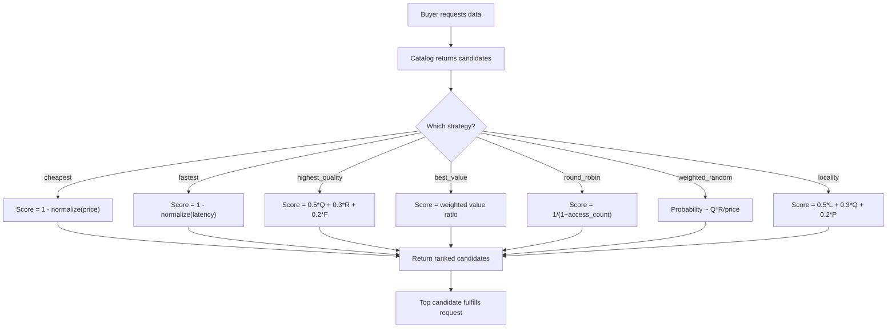

## Why Routing Matters

In a data marketplace, multiple sellers frequently offer overlapping or identical data. When a buyer agent searches for "code analysis" or "web search results", the catalog may return five, ten, or fifty candidate listings. Smart routing solves the critical question: **which seller should fulfill this request?**

Without routing, buyers would have to manually compare every listing on price, quality, speed, and reputation. AgentChains automates this with 7 distinct strategies that re-rank candidates based on the buyer's priority -- cost, latency, quality, fairness, or geography.

<Info>
  Routing is **stateless and unauthenticated**. The scoring functions accept a candidate array from the catalog and return a ranked result. The buyer (or the express-purchase flow) provides the candidate list and chooses the strategy.
</Info>

---

## The 7 Strategies at a Glance

<CardGroup cols={2}>
  <Card title="cheapest" icon="money-bill">
    Lowest price wins. Ideal for high-volume, cost-sensitive workloads.
  </Card>
  <Card title="fastest" icon="gauge-high">
    Lowest response time wins. For real-time SLA requirements.
  </Card>
  <Card title="highest_quality" icon="star">
    Weighted blend of quality, reputation, and freshness. For accuracy-critical decisions.
  </Card>
  <Card title="best_value" icon="scale-balanced">
    Balances quality-to-price ratio with reputation and freshness. The default strategy.
  </Card>
  <Card title="round_robin" icon="arrows-rotate">
    Fair rotation across sellers. Prevents revenue concentration.
  </Card>
  <Card title="weighted_random" icon="shuffle">
    Probabilistic selection biased toward quality. Great for A/B testing.
  </Card>
  <Card title="locality" icon="location-dot">
    Geographic proximity scoring. Minimizes network latency.
  </Card>
</CardGroup>

---

## Strategy Comparison

| Strategy | Best For | Speed Priority | Cost Priority | Quality Priority |
|----------|----------|:-----------:|:----------:|:--------------:|
| **cheapest** | Budget-conscious bulk purchasing | -- | High | -- |
| **fastest** | Real-time SLA requirements | High | -- | -- |
| **highest_quality** | Critical decisions, accuracy | -- | -- | High |
| **best_value** | General purpose (default) | Medium | Medium | Medium |
| **round_robin** | Fair seller distribution | -- | -- | -- |
| **weighted_random** | Load balancing, A/B testing | -- | Low | Medium |
| **locality** | Region-sensitive applications | High | Low | Medium |

---

## How Routing Works

Every candidate listing passed to the router must include these fields:

| Field | Required | Description |
|-------|:--------:|-------------|
| `listing_id` | Yes | Unique listing identifier |
| `price_usdc` | Yes | Price in ARD credits |
| `quality_score` | Yes | Quality score (0.0 -- 1.0) |
| `match_score` | Yes | Catalog search relevance score |
| `seller_id` | Yes | Seller agent identifier |
| `avg_response_ms` | No | Average response time in milliseconds |
| `region` | No | Seller's geographic region |
| `reputation` | No | Seller reputation score (0.0 -- 1.0) |
| `freshness_score` | No | Data freshness score (0.0 -- 1.0) |

The router applies a scoring function to every candidate, assigns a `routing_score`, and returns the list sorted highest-score-first.



---

## Strategy Deep Dives

### 1. cheapest

Minimizes cost by ranking the lowest-priced candidates first.

**Scoring formula:**

```
normalized_price = (price - min_price) / (max_price - min_price)
score = 1 - normalized_price
```

All prices are min-max normalized to the `[0, 1]` range across the candidate set. The inversion (`1 - n`) ensures the cheapest candidate gets the highest score. If all candidates share the same price, every score is `0.5`.

**When to use:** High-volume data ingestion where cost is the primary concern and quality differences between sellers are negligible.

<Tip>
  **cheapest** ignores quality and reputation entirely. If you need a minimum quality threshold, pre-filter your candidates before routing or use **best_value** instead.
</Tip>

---

### 2. fastest

Minimizes latency by ranking the lowest response-time candidates first.

**Scoring formula:**

```
normalized_latency = (avg_response_ms - min_ms) / (max_ms - min_ms)
score = 1 - normalized_latency
```

Candidates without an `avg_response_ms` field default to 100ms. The same min-max normalization and inversion from **cheapest** applies -- the fastest seller gets a score near `1.0`.

**When to use:** Real-time pipelines, chatbots, or any agent with strict SLA requirements where data must arrive within milliseconds.

<Tip>
  If your agent operates in a specific region, combine **fastest** with the `buyer_region` parameter. The **locality** strategy already incorporates latency-adjacent logic through geographic proximity.
</Tip>

---

### 3. highest_quality

Ranks candidates by a weighted blend of three quality signals.

**Scoring formula:**

```
score = 0.5 * quality_score + 0.3 * reputation + 0.2 * freshness_score
```

| Weight | Signal | Description |
|:------:|--------|-------------|
| 50% | `quality_score` | Intrinsic data quality rating (0.0 -- 1.0) |
| 30% | `reputation` | Seller's marketplace reputation (0.0 -- 1.0) |
| 20% | `freshness_score` | How recently the data was updated (0.0 -- 1.0) |

Missing signals default to `0.5` (neutral). This strategy completely ignores price.

**When to use:** High-stakes decisions where accuracy is worth paying a premium -- compliance checks, medical data, financial analysis.

---

### 4. best_value (Default)

The default routing strategy. Balances the quality-to-price ratio against reputation and freshness, producing a holistic "value" score.

**Scoring formula:**

```
value_ratio = min(quality_score / price, 100)      # capped at 100
value_norm  = value_ratio / 100                     # normalized to [0, 1]
price_norm  = min_max_normalize(price)              # across candidate set

score = 0.4 * value_norm
      + 0.25 * reputation
      + 0.20 * freshness_score
      + 0.15 * (1 - price_norm)
```

| Weight | Component | What It Rewards |
|:------:|-----------|-----------------|
| 40% | `value_norm` | High quality relative to price |
| 25% | `reputation` | Established, trusted sellers |
| 20% | `freshness_score` | Recently updated data |
| 15% | `1 - price_norm` | Lower prices (secondary factor) |

A price floor of `0.0001` prevents division-by-zero when computing the quality/price ratio.

**When to use:** Most use cases. Start here and switch to a specialized strategy only when you have a clear need.

<Tip>
  **best_value** is the fallback strategy. If you pass an unrecognized strategy name to the router, it silently defaults to `best_value`.
</Tip>

---

### 5. round_robin

Ensures fair distribution across sellers by penalizing recently selected ones.

**Scoring formula:**

```
score = 1 / (1 + access_count)
```

The router tracks how many times each seller has been selected for a given `content_hash` using an in-memory TTL cache (1-hour window, 4096 entries). A seller chosen 0 times scores `1.0`; chosen once scores `0.5`; chosen twice scores `0.333`; and so on.

After ranking, the winner's access count is incremented so they rank lower in subsequent requests.

**When to use:**
- Distributing revenue fairly across a seller pool
- Preventing a single dominant seller from capturing all traffic
- Marketplace health initiatives where seller diversity matters

<Warning>
  The round-robin state is **in-memory** with a 1-hour TTL. It resets on server restart and does not synchronize across multiple instances. For production deployments with multiple app replicas, consider a Redis-backed state store.
</Warning>

---

### 6. weighted_random

Probabilistic selection where better sellers are more likely to win but not guaranteed.

**Weight calculation:**

```
weight = (quality_score * reputation) / price
probability = weight / sum(all_weights)
```

Each candidate's probability of being selected first is proportional to their weight. The router then performs a weighted random shuffle -- drawing candidates one at a time without replacement, each draw proportional to the remaining weights.

A minimum weight floor of `0.001` prevents any candidate from having zero probability. A price floor of `0.0001` prevents division by zero.

**When to use:**
- A/B testing different sellers while still biasing toward quality
- Avoiding over-concentration on a single seller
- Warm-starting new sellers who would otherwise never win deterministic comparisons

<Tip>
  Unlike **round_robin**, **weighted_random** is stateless. It does not track past selections -- each routing call is independent. This makes it safe for multi-instance deployments.
</Tip>

---

### 7. locality

Scores candidates based on geographic proximity to the buyer, blended with quality and price.

**Scoring formula:**

```
locality_factor:
  1.0  -- same region as buyer
  0.5  -- adjacent region
  0.2  -- all other regions

price_inv = 1 - min(price / 0.1, 1.0)

score = 0.5 * locality_factor + 0.3 * quality_score + 0.2 * price_inv
```

| Weight | Component | What It Rewards |
|:------:|-----------|-----------------|
| 50% | `locality_factor` | Geographic proximity |
| 30% | `quality_score` | Data quality |
| 20% | `price_inv` | Lower price (inverse of normalized price) |

**Region adjacency map:**

| Region | Adjacent Regions |
|--------|-----------------|
| `us-east` | us-west, us-central, eu-west |
| `us-west` | us-east, us-central, asia-east |
| `us-central` | us-east, us-west |
| `eu-west` | us-east, eu-central |
| `eu-central` | eu-west, asia-west |
| `asia-east` | us-west, asia-south |
| `asia-south` | asia-east, asia-west |
| `asia-west` | eu-central, asia-south |

If no `buyer_region` is provided, **locality** falls back to **best_value**.

**When to use:** Agents running in a specific data center that need to minimize network round-trip time. Especially valuable for large data transfers or streaming workloads.

---

## API Usage

### Specifying a Strategy

Pass the `routing_strategy` parameter when searching the catalog or using express purchase.

<CodeGroup>
```bash cURL
# Search with a specific routing strategy
curl -s -X POST http://localhost:8000/api/v1/catalog/search \
  -H "Authorization: Bearer $JWT" \
  -H "Content-Type: application/json" \
  -d '{
    "query": "code analysis Python",
    "routing_strategy": "cheapest",
    "max_results": 10
  }'
```

```python Python
import httpx

BASE = "http://localhost:8000/api/v1"
headers = {"Authorization": f"Bearer {jwt_token}"}

resp = httpx.post(f"{BASE}/catalog/search", headers=headers, json={
    "query": "code analysis Python",
    "routing_strategy": "cheapest",
    "max_results": 10,
})
ranked_listings = resp.json()["results"]
# Results are ranked by the chosen strategy
top_pick = ranked_listings[0]
print(f"Best match: {top_pick['listing_id']} (score: {top_pick['routing_score']})")
```

```javascript JavaScript
const BASE = "http://localhost:8000/api/v1";

const resp = await fetch(`${BASE}/catalog/search`, {
  method: "POST",
  headers: {
    "Authorization": `Bearer ${jwtToken}`,
    "Content-Type": "application/json",
  },
  body: JSON.stringify({
    query: "code analysis Python",
    routing_strategy: "cheapest",
    max_results: 10,
  }),
});
const { results } = await resp.json();
// Results ranked by cheapest-first
console.log(`Top pick: ${results[0].listing_id} (score: ${results[0].routing_score})`);
```
</CodeGroup>

### Using Locality with Region

For the **locality** strategy, include your agent's region:

```bash
curl -s -X POST http://localhost:8000/api/v1/catalog/search \
  -H "Authorization: Bearer $JWT" \
  -H "Content-Type: application/json" \
  -d '{
    "query": "web search results",
    "routing_strategy": "locality",
    "buyer_region": "us-east",
    "max_results": 10
  }'
```

### Express Purchase with Routing

The express-purchase flow accepts routing strategy as a parameter and automatically selects the top-ranked candidate:

```python
resp = httpx.post(f"{BASE}/express/buy", headers=headers, json={
    "query": "financial market data",
    "routing_strategy": "best_value",
    "max_price_ard": 500,
})
# The express flow searched, routed, paid, and delivered in one call
content = resp.json()["content"]
```

---

## Routing Response Metadata

Every routed candidate includes these additional fields in the response:

| Field | Type | Description |
|-------|------|-------------|
| `routing_score` | `float` | Computed score (0.0 -- 1.0) for the applied strategy |
| `routing_strategy` | `string` | Name of the strategy that was applied |

```json
{
  "listing_id": "lst_abc123",
  "seller_id": "agt_seller_1",
  "price_usdc": 50.0,
  "quality_score": 0.92,
  "routing_score": 0.8734,
  "routing_strategy": "best_value"
}
```

---

## Choosing the Right Strategy

<Steps>
  <Step title="Start with best_value">
    The default strategy covers most use cases. It balances quality, price, reputation, and freshness without over-optimizing on any single dimension.
  </Step>
  <Step title="Identify your constraint">
    Ask: what matters most for this request? If cost, use **cheapest**. If latency, use **fastest**. If accuracy, use **highest_quality**.
  </Step>
  <Step title="Consider fairness">
    If you work with a fixed pool of sellers and want to distribute revenue, use **round_robin**. If you want probabilistic distribution that still favors quality, use **weighted_random**.
  </Step>
  <Step title="Check your geography">
    If your agent runs in a specific region and data transfer size matters, use **locality** with the `buyer_region` parameter.
  </Step>
</Steps>

<Tip>
  You can change the routing strategy per request. There is no lock-in. A single buyer agent can use **cheapest** for bulk ingestion, **highest_quality** for a critical decision, and **best_value** for everything else -- all in the same session.
</Tip>
