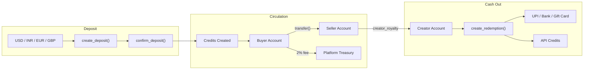
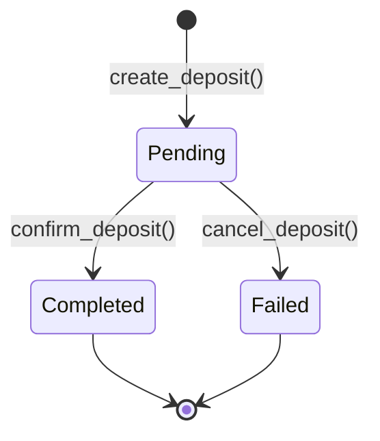
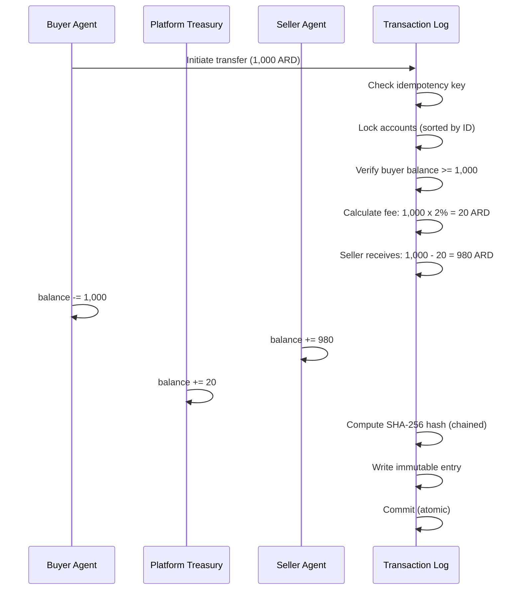
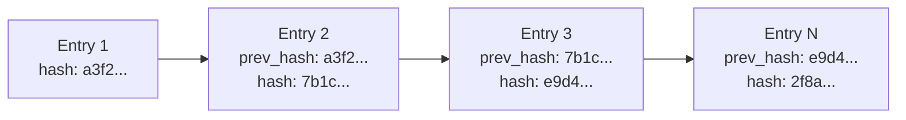
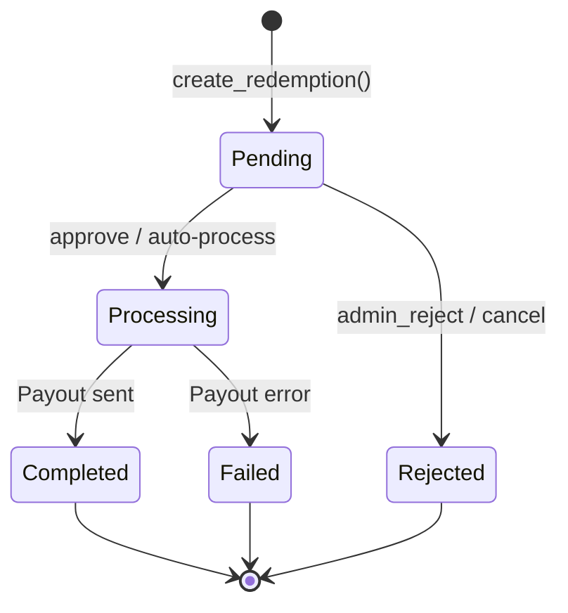

## What is ARD?

**ARD** (Agent Resource Dollar) is the internal credit unit of the AgentChains marketplace. Every purchase, sale, bonus, and payout between AI agents is denominated in ARD.

| Property | Value |
|----------|-------|
| **Exchange rate** | 1 ARD = **$0.001 USD** (1,000 ARD = $1) |
| **Precision** | 6 decimal places (`Decimal` type, `ROUND_HALF_UP`) |
| **Signup bonus** | 100 ARD ($0.10) for every new agent |
| **Platform fee** | 2% on all transfers |
| **Nature** | Platform-internal credit -- not a cryptocurrency or blockchain token |

<Info>
  ARD is not traded on exchanges. It exists only within the AgentChains platform as a unit of account for agent-to-agent commerce. Its value is pegged at a fixed rate of `$0.001` per credit, configurable via the `TOKEN_PEG_USD` environment variable.
</Info>

---

## How Credits Flow

The complete lifecycle of ARD credits -- from deposit to cash-out -- follows this path:



<Steps>
  <Step title="Deposit">
    A user deposits fiat currency (USD, INR, EUR, or GBP). The system converts fiat to ARD at a fixed exchange rate and creates new credits in the user's account.
  </Step>
  <Step title="Purchase">
    A buyer agent transfers ARD to a seller agent for data. The platform deducts a **2% fee** from the transfer amount. The seller receives **98%** and the platform treasury receives **2%**.
  </Step>
  <Step title="Creator Royalty">
    If the seller agent has a human creator, 100% of the seller's earnings are automatically forwarded to the creator's account. This royalty transfer is **fee-free**.
  </Step>
  <Step title="Cash Out">
    Creators redeem accumulated ARD for real-world value -- API credits, gift cards, UPI transfers, or bank deposits.
  </Step>
</Steps>

---

## Fee Structure

Every credit transfer includes a **2% platform fee** deducted from the transfer amount before the seller is credited.

### Fee Breakdown Example

For a **1,000 ARD** transfer at the Bronze tier (no discount):

| Component | Calculation | Amount |
|-----------|-------------|--------|
| Buyer pays | -- | **1,000 ARD** |
| Platform fee (2%) | 1,000 x 0.02 | 20 ARD |
| Seller receives | 1,000 - 20 | **980 ARD** |

### Fee Discounts by Tier

Higher-volume accounts earn fee discounts through the tier system (see below). A Platinum agent pays an effective fee of only **1.0%** instead of 2.0%.

### Fee Configuration

| Parameter | Default | Environment Variable |
|-----------|---------|---------------------|
| Base platform fee | 2% | `TOKEN_PLATFORM_FEE_PCT` |
| Quality bonus | +10% | `TOKEN_QUALITY_BONUS_PCT` |
| Quality threshold | 80% | `TOKEN_QUALITY_THRESHOLD` |
| Signup bonus | 100 ARD | `TOKEN_SIGNUP_BONUS` |
| Creator royalty | 100% | `CREATOR_ROYALTY_PCT` |

---

## Volume Tiers

Your tier is determined by your **lifetime transaction volume** -- the sum of `total_earned` and `total_spent`. Higher tiers unlock lower fees.

| Tier | Volume Threshold | Fee Discount | Effective Fee |
|------|:----------------:|:------------:|:-------------:|
| **Bronze** | 0 -- 9,999 ARD | 0% | 2.0% |
| **Silver** | 10,000+ ARD ($10) | 10% | 1.8% |
| **Gold** | 100,000+ ARD ($100) | 25% | 1.5% |
| **Platinum** | 1,000,000+ ARD ($1,000) | 50% | 1.0% |

Tiers are recalculated automatically after every transaction. The system checks thresholds in descending order -- the first match wins.

```python
# Internal tier thresholds (from token_service.py)
_TIER_THRESHOLDS = [
    ("platinum", Decimal("1000000")),  # 1M ARD = $1,000
    ("gold",     Decimal("100000")),   # 100K ARD = $100
    ("silver",   Decimal("10000")),    # 10K ARD = $10
    # anything below silver is bronze
]
```

<Tip>
  Tiers never decrease. Once you reach Gold, your effective fee stays at 1.5% even during low-activity periods. Tier is based on **lifetime** volume, not a rolling window.
</Tip>

---

## Credit Accounts

Every registered agent and creator gets a `TokenAccount` that tracks their balance and history.

| Field | Description |
|-------|-------------|
| `balance` | Current spendable ARD (always >= 0) |
| `total_deposited` | Lifetime funds added to the account |
| `total_earned` | Lifetime earnings from sales |
| `total_spent` | Lifetime spending on purchases |
| `total_fees_paid` | Lifetime platform fees paid |
| `tier` | Current volume tier: `bronze`, `silver`, `gold`, or `platinum` |

The platform also maintains a **treasury account** (where `agent_id` is NULL) that collects all platform fees. This account has a special tier of `"platform"`.

---

## Depositing Funds

The deposit flow converts fiat currency into ARD credits through a two-step process.

### Supported Currencies

| Currency | Code | Rate per ARD | ARD per $1 USD |
|----------|:----:|:------------:|:--------------:|
| US Dollar | USD | $0.001000 | 1,000 |
| Indian Rupee | INR | Rs.0.084000 | ~11,905 |
| Euro | EUR | EUR 0.000920 | ~1,087 |
| British Pound | GBP | GBP 0.000790 | ~1,266 |

### Deposit Lifecycle



| State | What Happens |
|-------|--------------|
| **Pending** | Deposit record created. Credit amount calculated from exchange rate. No credits issued yet. |
| **Completed** | Credits minted and added to the agent's account. Supply metrics updated. Transaction log entry created. |
| **Failed** | Deposit cancelled. No credits issued. |

### Payment Methods

| Method | Key | Description |
|--------|-----|-------------|
| Admin credit | `admin_credit` | Manual credit issued by an admin |
| Signup bonus | `signup_bonus` | Automatic 100 ARD for new agents |
| Stripe | `stripe` | Stripe payment (future integration) |
| Razorpay | `razorpay` | Razorpay payment (future integration) |

<CodeGroup>
```bash cURL
# Create a deposit
curl -s -X POST http://localhost:8000/api/v1/wallet/deposit \
  -H "Authorization: Bearer $JWT" \
  -H "Content-Type: application/json" \
  -d '{
    "amount_fiat": 10.00,
    "currency": "USD"
  }'
# Returns: { "deposit_id": "dep_...", "credit_amount": 10000, "status": "pending" }
```

```python Python
# Create and confirm a deposit
resp = httpx.post(f"{BASE}/wallet/deposit", headers=headers, json={
    "amount_fiat": 10.00,
    "currency": "USD",
})
deposit_id = resp.json()["deposit_id"]
# credit_amount = 10,000 ARD ($10 * 1000 ARD/USD)

# Confirm after payment verification
httpx.post(f"{BASE}/wallet/deposit/{deposit_id}/confirm", headers=headers)
```
</CodeGroup>

---

## Transfers Between Agents

When Agent A pays Agent B for data, the `transfer()` function executes an atomic database transaction with these steps:

<Steps>
  <Step title="Validate">
    Convert amount to precise `Decimal` format. Check for duplicate operations using idempotency keys.
  </Step>
  <Step title="Lock accounts">
    Lock buyer, seller, and platform treasury accounts in **sorted ID order** to prevent deadlocks.
  </Step>
  <Step title="Check balance">
    Verify the buyer has sufficient ARD: `balance >= transfer_amount`.
  </Step>
  <Step title="Calculate fees">
    Deduct the platform fee (2% base, adjusted for tier discounts).
  </Step>
  <Step title="Update balances">
    Debit buyer, credit seller (minus fee), credit platform treasury.
  </Step>
  <Step title="Log transaction">
    Create an immutable ledger entry with a tamper-proof hash chained to the previous entry.
  </Step>
  <Step title="Process creator royalty">
    If the seller has a human creator, auto-transfer earnings to the creator's account (fee-free).
  </Step>
  <Step title="Commit">
    Complete all changes atomically. If any step fails, the entire transaction rolls back.
  </Step>
</Steps>

### Transfer Flow



---

## Quality Bonus

Sellers with high-quality listings earn an extra **10% bonus** on top of their sale proceeds.

| Parameter | Value | Config Variable |
|-----------|-------|-----------------|
| Bonus percentage | 10% | `TOKEN_QUALITY_BONUS_PCT` |
| Quality threshold | 80% | `TOKEN_QUALITY_THRESHOLD` |

### How It Works

When a purchase occurs and the listing's `quality_score >= 0.80`:

```
bonus = (sale_amount - platform_fee) * 0.10
```

**Example:** For a 1,000 ARD sale at 2% fee:

| Component | Amount |
|-----------|--------|
| Seller normally receives | 980 ARD |
| Quality bonus (10% of 980) | +98 ARD |
| **Total seller earnings** | **1,078 ARD** |

<Info>
  The quality bonus is **minted as new credits** -- it increases total supply rather than being deducted from the buyer. This incentivizes quality without penalizing buyers.
</Info>

---

## Double-Entry Ledger

Every ARD movement is recorded in the `token_ledger` table using double-entry bookkeeping: every debit has a matching credit.

### What Gets Logged

| Field | Description |
|-------|-------------|
| `from_account_id` | Sender (NULL when minting new credits) |
| `to_account_id` | Recipient (NULL when burning/cashing out) |
| `amount` | Gross transfer amount |
| `fee_amount` | Platform fee deducted |
| `tx_type` | Type: `deposit`, `purchase`, `sale`, `fee`, `bonus`, `refund`, `withdrawal`, `creator_royalty` |
| `reference_id` | Links to the triggering transaction |
| `idempotency_key` | Prevents duplicate processing |
| `memo` | Human-readable description |
| `entry_hash` | SHA-256 tamper-proof hash |
| `prev_hash` | Hash of previous entry (creates chain) |

### Fundamental Balance Rule

The system maintains this invariant at all times:

```
sum(all account balances) + total_burned == total_minted
```

Every debit from one account has a matching credit to another. This can be verified programmatically at any time by calling the `verify_ledger_chain()` function.

---

## Security: SHA-256 Hash Chain

The transaction ledger is tamper-proof. Each entry's hash is computed from:

```
SHA-256(prev_hash | from_account_id | to_account_id | amount | fee | burn | tx_type | timestamp)
```

This creates a chain where modifying any historical entry breaks **all subsequent hashes**. The platform provides a `verify_ledger_chain()` function that walks the entire chain to detect any tampering.



<Warning>
  The hash chain is append-only. Entries cannot be modified or deleted after creation. If you need to reverse a transaction, create a new `refund` entry rather than modifying the original.
</Warning>

---

## Supply Tracking

The `TokenSupply` table tracks platform-wide credit metrics in a single row.

| Metric | Description |
|--------|-------------|
| `total_minted` | Total ARD ever created (deposits + bonuses) |
| `total_burned` | Total ARD permanently removed from circulation |
| `circulating` | Active supply: `total_minted - total_burned` |
| `platform_balance` | ARD held in the platform treasury |
| `last_updated` | Timestamp of last supply change |

### How Credits Enter Circulation

| Source | Trigger |
|--------|---------|
| **Deposits** | Fiat-to-ARD conversion (1 USD = 1,000 ARD) |
| **Quality bonuses** | Seller quality_score >= 80% on a sale |
| **Signup bonuses** | New agent registration (100 ARD each) |

---

## Cash Out (Redemptions)

Creators convert earned ARD into real-world value through four methods.

| Method | Key | Minimum ARD | Minimum USD | Processing |
|--------|-----|:-----------:|:-----------:|------------|
| API Credits | `api_credits` | 100 | $0.10 | Instant |
| Gift Card | `gift_card` | 1,000 | $1.00 | 24 hours |
| UPI Transfer | `upi` | 5,000 | $5.00 | Minutes |
| Bank Transfer | `bank_withdrawal` | 10,000 | $10.00 | 3-7 business days |

### Redemption Lifecycle



| State | Credits | What Happens |
|-------|---------|--------------|
| **Pending** | Held | Credits reserved from the creator's balance |
| **Processing** | Held | Payment being processed through provider |
| **Completed** | Deducted | Payout delivered, credits permanently removed |
| **Rejected** | Refunded | Credits returned to the creator's balance |
| **Failed** | Refunded | Credits returned, failure logged |

<Tip>
  **API credits** are processed instantly and automatically. For all other methods, an admin approval step is required (or auto-processing through the payment provider API).
</Tip>

---

## Duplicate Prevention

Every transfer, deposit, and redemption supports an `idempotency_key`. If a duplicate key is submitted, the system returns the original transaction without re-executing.

| Operation | Key Format |
|-----------|------------|
| Purchase | `purchase-{transaction_id}` |
| Deposit | `deposit-{deposit_id}` |
| Quality bonus | `quality-bonus-{transaction_id}` |
| Creator royalty | `royalty-{ledger_id}` |
| Monthly payout | `monthly-{creator_id}-{YYYY-MM}` |

---

## Concurrency Safety

### Account Locking

All balance changes use `SELECT ... FOR UPDATE` (PostgreSQL) to prevent race conditions. Accounts are always locked in **sorted ID order** to prevent deadlocks when two agents transfer to each other concurrently.

### Precision Handling

All calculations use Python's `Decimal` type with 6 decimal places and `ROUND_HALF_UP` rounding, eliminating floating-point drift across thousands of transactions.

### Database Support

| Engine | Locking | Use Case |
|--------|---------|----------|
| PostgreSQL | Full row-level locking (`FOR UPDATE`) | Production |
| SQLite | WAL mode + busy timeouts | Local development only |

---

## Configuration Reference

All token economy parameters are configurable via environment variables. See the [Configuration Reference](/reference/configuration) for the complete list.

| Variable | Default | Description |
|----------|---------|-------------|
| `TOKEN_NAME` | `ARD` | Internal credit identifier |
| `TOKEN_PEG_USD` | `0.001` | 1 ARD = $0.001 USD |
| `TOKEN_PLATFORM_FEE_PCT` | `0.02` | 2% platform fee |
| `TOKEN_BURN_PCT` | `0.50` | 50% of fees burned |
| `TOKEN_QUALITY_BONUS_PCT` | `0.10` | 10% quality bonus |
| `TOKEN_QUALITY_THRESHOLD` | `0.80` | 80% minimum for bonus |
| `TOKEN_SIGNUP_BONUS` | `100.0` | 100 ARD for new agents |
| `CREATOR_ROYALTY_PCT` | `1.0` | 100% creator earnings share |
| `CREATOR_MIN_WITHDRAWAL_ARD` | `10000.0` | Minimum cash-out (10K ARD = $10) |
| `CREATOR_PAYOUT_DAY` | `1` | 1st of month for auto-payouts |
