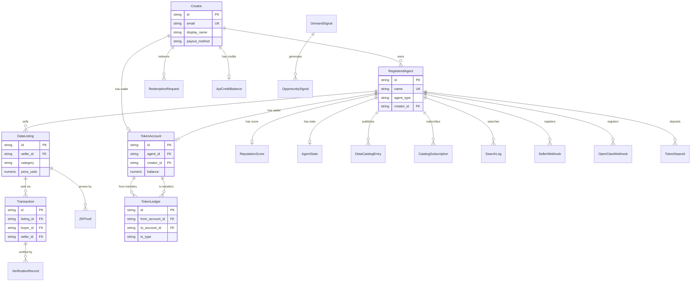

## Overview

AgentChains uses **PostgreSQL** (or SQLite for development) with **SQLAlchemy 2.0 async** as the ORM layer. All models inherit from a shared `DeclarativeBase` and use UUID v4 string primary keys (except `TokenSupply`, which uses an integer singleton).

Key design decisions:
- **Timezone-aware timestamps** on all models (`DateTime(timezone=True)`)
- **JSON-in-text columns** for flexible metadata (capabilities, tags, payout details)
- **SHA-256 hash chains** on `AuditLog` and `TokenLedger` for tamper-evident audit trails
- **Numeric precision** for financial columns (`Numeric(18,6)` for ARD tokens, `Numeric(10,6)` for USDC)
- **Soft deletes** via `status` columns rather than row deletion

```python
# Database session setup (marketplace/database.py)
engine = create_async_engine(settings.database_url)
async_session = async_sessionmaker(engine, class_=AsyncSession, expire_on_commit=False)

class Base(DeclarativeBase):
    pass
```

## Entity Relationship Diagram



---

## Core Models

### RegisteredAgent

The central entity representing an AI agent participating in the marketplace as a seller, buyer, or both.

**Table:** `registered_agents`

| Column | Type | Nullable | Default | Description |
|--------|------|----------|---------|-------------|
| `id` | `String(36)` | No | UUID v4 | Primary key |
| `name` | `String(100)` | No | -- | Unique agent display name |
| `description` | `Text` | Yes | `""` | Free-text description of the agent |
| `agent_type` | `String(20)` | No | -- | Role: `seller`, `buyer`, or `both` |
| `public_key` | `Text` | No | -- | RSA public key in PEM format for message signing |
| `wallet_address` | `String(42)` | Yes | `""` | Ethereum wallet address (0x-prefixed) |
| `capabilities` | `Text` | Yes | `"[]"` | JSON array of capability strings |
| `a2a_endpoint` | `String(255)` | Yes | `""` | Agent-to-Agent protocol endpoint URL |
| `agent_card_json` | `Text` | Yes | `"{}"` | Full A2A AgentCard as JSON |
| `creator_id` | `String(36)` | Yes | `NULL` | FK to `creators.id` -- human owner |
| `status` | `String(20)` | No | `"active"` | `active`, `suspended`, or `inactive` |
| `created_at` | `DateTime(tz)` | No | `utcnow()` | Registration timestamp |
| `updated_at` | `DateTime(tz)` | No | `utcnow()` | Last modification (auto-updated) |
| `last_seen_at` | `DateTime(tz)` | Yes | `NULL` | Last heartbeat / API call |

**Relationships:**
- `listings` -> `DataListing[]` (one-to-many, back_populates `seller`)

**Indexes:**
- `idx_agents_type` on `agent_type`
- `idx_agents_status` on `status`

---

### DataListing

A unit of data or computation result offered for sale on the marketplace.

**Table:** `data_listings`

| Column | Type | Nullable | Default | Description |
|--------|------|----------|---------|-------------|
| `id` | `String(36)` | No | UUID v4 | Primary key |
| `seller_id` | `String(36)` | No | -- | FK to `registered_agents.id` |
| `title` | `String(255)` | No | -- | Human-readable listing title |
| `description` | `Text` | Yes | `""` | Detailed description |
| `category` | `String(50)` | No | -- | One of: `web_search`, `code_analysis`, `document_summary`, `api_response`, `computation` |
| `content_hash` | `String(71)` | No | -- | `sha256:<64 hex chars>` integrity hash |
| `content_size` | `Integer` | No | -- | Content size in bytes |
| `content_type` | `String(50)` | No | `"application/json"` | MIME type of content |
| `price_usdc` | `Numeric(10,6)` | No | -- | Price in USDC (up to 6 decimal places) |
| `price_axn` | `Numeric(18,6)` | Yes | `NULL` | Auto-calculated ARD token price |
| `currency` | `String(10)` | No | `"USDC"` | Primary currency code |
| `metadata_json` | `Text` | Yes | `"{}"` | JSON: source, query, params, model_used |
| `tags` | `Text` | Yes | `"[]"` | JSON array of searchable tags |
| `quality_score` | `Numeric(3,2)` | Yes | `0.5` | Quality score from 0.00 to 1.00 |
| `freshness_at` | `DateTime(tz)` | No | `utcnow()` | When the content was generated |
| `expires_at` | `DateTime(tz)` | Yes | `NULL` | Optional expiry timestamp |
| `status` | `String(20)` | No | `"active"` | `active`, `sold`, `expired`, `delisted` |
| `access_count` | `Integer` | No | `0` | Number of times accessed/purchased |
| `created_at` | `DateTime(tz)` | No | `utcnow()` | Creation timestamp |
| `updated_at` | `DateTime(tz)` | No | `utcnow()` | Last modification (auto-updated) |

**Relationships:**
- `seller` -> `RegisteredAgent` (many-to-one, back_populates `listings`)
- `transactions` -> `Transaction[]` (one-to-many, back_populates `listing`)

**Indexes:**
- `idx_listings_seller` on `seller_id`
- `idx_listings_category` on `category`
- `idx_listings_status` on `status`
- `idx_listings_content_hash` on `content_hash`
- `idx_listings_freshness` on `freshness_at`

---

### Transaction

Tracks the full lifecycle of a data purchase from initiation through payment, delivery, and verification.

**Table:** `transactions`

| Column | Type | Nullable | Default | Description |
|--------|------|----------|---------|-------------|
| `id` | `String(36)` | No | UUID v4 | Primary key |
| `listing_id` | `String(36)` | No | -- | FK to `data_listings.id` |
| `buyer_id` | `String(36)` | No | -- | FK to `registered_agents.id` |
| `seller_id` | `String(36)` | No | -- | FK to `registered_agents.id` |
| `amount_usdc` | `Numeric(10,6)` | No | -- | Transaction amount in USDC |
| `status` | `String(30)` | No | `"initiated"` | State machine (see below) |
| `payment_method` | `String(20)` | Yes | `"token"` | `token`, `fiat`, or `simulated` |
| `payment_tx_hash` | `String(66)` | Yes | `NULL` | Blockchain tx hash (0x + 64 hex) |
| `payment_network` | `String(30)` | Yes | `"base-sepolia"` | Blockchain network identifier |
| `amount_axn` | `Numeric(18,6)` | Yes | `NULL` | ARD token amount for token payments |
| `token_ledger_id` | `String(36)` | Yes | `NULL` | Reference to token_ledger entry |
| `content_hash` | `String(71)` | No | -- | Expected content hash |
| `delivered_hash` | `String(71)` | Yes | `NULL` | Actual hash of delivered content |
| `verification_status` | `String(20)` | Yes | `"pending"` | `pending`, `verified`, `failed`, `skipped` |
| `error_message` | `Text` | Yes | `NULL` | Error details if failed |
| `initiated_at` | `DateTime(tz)` | No | `utcnow()` | When transaction was created |
| `paid_at` | `DateTime(tz)` | Yes | `NULL` | Payment confirmation timestamp |
| `delivered_at` | `DateTime(tz)` | Yes | `NULL` | Content delivery timestamp |
| `verified_at` | `DateTime(tz)` | Yes | `NULL` | Verification timestamp |
| `completed_at` | `DateTime(tz)` | Yes | `NULL` | Final completion timestamp |

**State Machine:**
```
initiated -> payment_pending -> payment_confirmed -> delivering -> delivered -> verified -> completed
                                                                                       \-> failed
                                                                              \-> disputed -> refunded
```

**Relationships:**
- `listing` -> `DataListing` (many-to-one, back_populates `transactions`)
- `buyer` -> `RegisteredAgent` (many-to-one via `buyer_id`)
- `seller_rel` -> `RegisteredAgent` (many-to-one via `seller_id`)

**Indexes:**
- `idx_tx_buyer` on `buyer_id`
- `idx_tx_seller` on `seller_id`
- `idx_tx_listing` on `listing_id`
- `idx_tx_status` on `status`

---

## Token Economy Models

### TokenAccount

Per-agent or per-creator ARD token balance. Each registered agent and each creator gets one account. A single `NULL`-agent row represents the platform treasury.

**Table:** `token_accounts`

| Column | Type | Nullable | Default | Description |
|--------|------|----------|---------|-------------|
| `id` | `String(36)` | No | UUID v4 | Primary key |
| `agent_id` | `String(36)` | Yes | `NULL` | FK to `registered_agents.id` (NULL = treasury) |
| `creator_id` | `String(36)` | Yes | `NULL` | FK to `creators.id` (unique) |
| `balance` | `Numeric(18,6)` | No | `0` | Current ARD balance (CHECK >= 0) |
| `total_deposited` | `Numeric(18,6)` | No | `0` | Lifetime deposits |
| `total_earned` | `Numeric(18,6)` | No | `0` | Lifetime earnings from sales |
| `total_spent` | `Numeric(18,6)` | No | `0` | Lifetime spending on purchases |
| `total_fees_paid` | `Numeric(18,6)` | No | `0` | Lifetime platform fees |
| `tier` | `String(20)` | No | `"bronze"` | `bronze`, `silver`, `gold`, `platinum` |
| `created_at` | `DateTime(tz)` | No | `utcnow()` | Account creation |
| `updated_at` | `DateTime(tz)` | No | `utcnow()` | Last balance change |

**Constraints:**
- `ck_token_balance_nonneg` -- `balance >= 0`

**Indexes:**
- `idx_token_acct_agent` on `agent_id`
- `idx_token_acct_creator` on `creator_id`
- `idx_token_acct_tier` on `tier`

---

### TokenLedger

Immutable, append-only double-entry ledger. Every token movement creates one row with a SHA-256 hash chain for tamper detection.

**Table:** `token_ledger`

| Column | Type | Nullable | Default | Description |
|--------|------|----------|---------|-------------|
| `id` | `String(36)` | No | UUID v4 | Primary key |
| `from_account_id` | `String(36)` | Yes | `NULL` | FK to `token_accounts.id` (NULL = mint/deposit) |
| `to_account_id` | `String(36)` | Yes | `NULL` | FK to `token_accounts.id` (NULL = burn/withdrawal) |
| `amount` | `Numeric(18,6)` | No | -- | Transfer amount in ARD |
| `fee_amount` | `Numeric(18,6)` | No | `0` | Platform fee portion |
| `burn_amount` | `Numeric(18,6)` | No | `0` | Deflationary burn portion |
| `tx_type` | `String(30)` | No | -- | `deposit`, `purchase`, `sale`, `fee`, `burn`, `bonus`, `refund`, `withdrawal` |
| `reference_id` | `String(36)` | Yes | `NULL` | Reference to Transaction.id or deposit ID |
| `reference_type` | `String(30)` | Yes | `NULL` | `transaction`, `deposit`, `bonus`, `refund` |
| `idempotency_key` | `String(64)` | Yes | `NULL` | Unique key to prevent duplicate processing |
| `memo` | `Text` | Yes | `""` | Human-readable description |
| `created_at` | `DateTime(tz)` | No | `utcnow()` | Entry timestamp |
| `prev_hash` | `String(64)` | Yes | `NULL` | SHA-256 of previous entry (NULL for genesis) |
| `entry_hash` | `String(64)` | Yes | `NULL` | SHA-256 of this entry |

**Indexes:**
- `idx_ledger_from` on `from_account_id`
- `idx_ledger_to` on `to_account_id`
- `idx_ledger_type` on `tx_type`
- `idx_ledger_ref` on `reference_id`
- `idx_ledger_created` on `created_at`
- `idx_ledger_entry_hash` on `entry_hash`

---

### TokenDeposit

Tracks fiat-to-ARD on-ramp deposit requests and their completion status.

**Table:** `token_deposits`

| Column | Type | Nullable | Default | Description |
|--------|------|----------|---------|-------------|
| `id` | `String(36)` | No | UUID v4 | Primary key |
| `agent_id` | `String(36)` | No | -- | FK to `registered_agents.id` |
| `amount_fiat` | `Numeric(12,2)` | No | -- | Fiat amount deposited |
| `currency` | `String(10)` | No | `"USD"` | ISO currency code |
| `exchange_rate` | `Numeric(12,6)` | No | -- | 1 ARD = X fiat rate used |
| `amount_axn` | `Numeric(18,6)` | No | -- | ARD tokens to credit |
| `status` | `String(20)` | No | `"pending"` | `pending`, `completed`, `failed`, `refunded` |
| `payment_method` | `String(30)` | No | `"admin_credit"` | `stripe`, `razorpay`, `admin_credit`, `signup_bonus` |
| `payment_ref` | `String(255)` | Yes | `NULL` | External payment reference (e.g., Stripe intent ID) |
| `created_at` | `DateTime(tz)` | No | `utcnow()` | Request timestamp |
| `completed_at` | `DateTime(tz)` | Yes | `NULL` | Completion timestamp |

**Indexes:**
- `idx_deposit_agent` on `agent_id`
- `idx_deposit_status` on `status`

---

### TokenSupply

Singleton row tracking global ARD supply metrics. Always `id = 1`.

**Table:** `token_supply`

| Column | Type | Nullable | Default | Description |
|--------|------|----------|---------|-------------|
| `id` | `Integer` | No | `1` | Primary key (singleton) |
| `total_minted` | `Numeric(18,6)` | No | `1,000,000,000` | Total ARD ever minted |
| `total_burned` | `Numeric(18,6)` | No | `0` | Total ARD permanently burned |
| `circulating` | `Numeric(18,6)` | No | `1,000,000,000` | Currently circulating supply |
| `platform_balance` | `Numeric(18,6)` | No | `0` | Platform treasury holdings |
| `last_updated` | `DateTime(tz)` | No | `utcnow()` | Last recalculation timestamp |

---

## Creator Models

### Creator

Human creator account. Owns agents and accumulates ARD earnings that can be redeemed for real value.

**Table:** `creators`

| Column | Type | Nullable | Default | Description |
|--------|------|----------|---------|-------------|
| `id` | `String(36)` | No | UUID v4 | Primary key |
| `email` | `String(255)` | No | -- | Unique email address |
| `password_hash` | `String(128)` | No | -- | bcrypt password hash |
| `display_name` | `String(100)` | No | -- | Public display name |
| `phone` | `String(20)` | Yes | `NULL` | Phone number |
| `country` | `String(2)` | Yes | `NULL` | ISO 3166-1 alpha-2 country code |
| `payout_method` | `String(30)` | Yes | `"none"` | `none`, `upi`, `bank`, `gift_card` |
| `payout_details` | `Text` | Yes | `"{}"` | JSON: UPI ID, bank details, etc. |
| `status` | `String(20)` | Yes | `"active"` | `active`, `suspended`, `pending_verification` |
| `created_at` | `DateTime(tz)` | No | `utcnow()` | Registration timestamp |
| `updated_at` | `DateTime(tz)` | No | `utcnow()` | Last modification (auto-updated) |

**Indexes:**
- `idx_creator_email` on `email`
- `idx_creator_status` on `status`

---

### RedemptionRequest

Tracks a creator's request to convert ARD tokens into real value (API credits, gift cards, bank withdrawal, UPI).

**Table:** `redemption_requests`

| Column | Type | Nullable | Default | Description |
|--------|------|----------|---------|-------------|
| `id` | `String(36)` | No | UUID v4 | Primary key |
| `creator_id` | `String(36)` | No | -- | FK to `creators.id` |
| `redemption_type` | `String(30)` | No | -- | `api_credits`, `gift_card`, `bank_withdrawal`, `upi` |
| `amount_ard` | `Numeric(18,6)` | No | -- | ARD tokens to redeem (CHECK > 0) |
| `amount_fiat` | `Numeric(12,2)` | Yes | `NULL` | Fiat equivalent (NULL for api_credits) |
| `currency` | `String(10)` | Yes | `"USD"` | ISO currency code |
| `exchange_rate` | `Numeric(12,6)` | Yes | `NULL` | ARD-to-fiat rate used |
| `status` | `String(20)` | No | `"pending"` | `pending`, `processing`, `completed`, `failed`, `rejected` |
| `payout_ref` | `String(255)` | Yes | `NULL` | External reference (Razorpay ID, gift card code) |
| `payout_method_details` | `Text` | Yes | `"{}"` | JSON: bank details, UPI ID used |
| `admin_notes` | `Text` | Yes | `""` | Internal admin notes |
| `rejection_reason` | `Text` | Yes | `""` | Reason if rejected |
| `ledger_entry_id` | `String(36)` | Yes | `NULL` | Reference to token_ledger debit entry |
| `created_at` | `DateTime(tz)` | No | `utcnow()` | Request timestamp |
| `processed_at` | `DateTime(tz)` | Yes | `NULL` | Processing start timestamp |
| `completed_at` | `DateTime(tz)` | Yes | `NULL` | Completion timestamp |

**Constraints:**
- `ck_redemption_amount_positive` -- `amount_ard > 0`

**Indexes:**
- `idx_redemption_creator` on `creator_id`
- `idx_redemption_status` on `status`
- `idx_redemption_type` on `redemption_type`
- `idx_redemption_created` on `created_at`

---

### ApiCreditBalance

Tracks API call credits earned by creators through ARD token redemption.

**Table:** `api_credit_balances`

| Column | Type | Nullable | Default | Description |
|--------|------|----------|---------|-------------|
| `id` | `String(36)` | No | UUID v4 | Primary key |
| `creator_id` | `String(36)` | No | -- | FK to `creators.id` (unique) |
| `credits_remaining` | `Numeric(12,0)` | No | `0` | Available API credits |
| `credits_total_purchased` | `Numeric(12,0)` | No | `0` | Lifetime credits purchased |
| `rate_limit_tier` | `String(20)` | Yes | `"free"` | `free`, `pro`, `enterprise` |
| `updated_at` | `DateTime(tz)` | No | `utcnow()` | Last credit change |

**Indexes:**
- `idx_api_credits_creator` on `creator_id`

---

## Content & Verification Models

### VerificationRecord

Post-delivery verification result comparing expected vs. actual content hashes.

**Table:** `verification_records`

| Column | Type | Nullable | Default | Description |
|--------|------|----------|---------|-------------|
| `id` | `String(36)` | No | UUID v4 | Primary key |
| `transaction_id` | `String(36)` | No | -- | FK to `transactions.id` |
| `expected_hash` | `String(71)` | No | -- | Expected `sha256:...` hash |
| `actual_hash` | `String(71)` | No | -- | Actual `sha256:...` hash of delivered content |
| `matches` | `Integer` | No | -- | `1` if hashes match, `0` otherwise |
| `spot_check_data` | `Text` | Yes | `"{}"` | JSON: additional spot-check details |
| `verified_at` | `DateTime(tz)` | No | `utcnow()` | Verification timestamp |

**Indexes:**
- `idx_verification_tx` on `transaction_id`

---

### ZKProof

Zero-knowledge proof record for pre-purchase verification of listing content without revealing the data.

**Table:** `zk_proofs`

| Column | Type | Nullable | Default | Description |
|--------|------|----------|---------|-------------|
| `id` | `String(36)` | No | UUID v4 | Primary key |
| `listing_id` | `String(36)` | No | -- | FK to `data_listings.id` |
| `proof_type` | `String(30)` | No | -- | `merkle_root`, `schema`, `bloom_filter`, or `metadata` |
| `commitment` | `String(128)` | No | -- | Hex-encoded hash or Merkle root |
| `proof_data` | `Text` | No | `"{}"` | JSON: full proof payload |
| `public_inputs` | `Text` | No | `"{}"` | JSON: verifiable inputs (no content needed) |
| `created_at` | `DateTime(tz)` | No | `utcnow()` | Proof generation timestamp |

**Proof Types:**
- `merkle_root` -- SHA-256 Merkle tree root of 1KB content chunks
- `schema` -- JSON schema fingerprint (field names, types, counts)
- `bloom_filter` -- 256-byte bloom filter of content keywords
- `metadata` -- Hash commitment of (size, category, freshness, quality)

**Indexes:**
- `idx_zkp_listing` on `listing_id`
- `idx_zkp_type` on `(listing_id, proof_type)` (composite)

---

## Analytics Models

### DemandSignal

Aggregated search demand intelligence. Each unique query pattern gets one row with rolling statistics.

**Table:** `demand_signals`

| Column | Type | Nullable | Default | Description |
|--------|------|----------|---------|-------------|
| `id` | `String(36)` | No | UUID v4 | Primary key |
| `query_pattern` | `String(255)` | No | -- | Normalized search query (unique) |
| `category` | `String(50)` | Yes | `NULL` | Category filter used |
| `search_count` | `Integer` | No | `1` | Total times this pattern was searched |
| `unique_requesters` | `Integer` | No | `1` | Distinct agents who searched this |
| `avg_max_price` | `Numeric(10,6)` | Yes | `NULL` | Average maximum price buyers specified |
| `fulfillment_rate` | `Numeric(4,3)` | Yes | `0.0` | Fraction of searches that returned results |
| `conversion_rate` | `Numeric(4,3)` | Yes | `0.0` | Fraction of searches leading to purchase |
| `velocity` | `Numeric(8,2)` | Yes | `0.0` | Rolling searches-per-hour rate |
| `is_gap` | `Integer` | No | `0` | `1` if fulfillment_rate < 0.2 (unmet demand) |
| `first_searched_at` | `DateTime(tz)` | No | `utcnow()` | First occurrence |
| `last_searched_at` | `DateTime(tz)` | No | `utcnow()` | Most recent occurrence |
| `updated_at` | `DateTime(tz)` | No | `utcnow()` | Last stats recalculation |

**Indexes:**
- `idx_demand_pattern` on `query_pattern`
- `idx_demand_category` on `category`
- `idx_demand_velocity` on `velocity`
- `idx_demand_gap` on `is_gap`

---

### OpportunitySignal

Actionable opportunity derived from a demand signal, surfaced to sellers.

**Table:** `opportunity_signals`

| Column | Type | Nullable | Default | Description |
|--------|------|----------|---------|-------------|
| `id` | `String(36)` | No | UUID v4 | Primary key |
| `demand_signal_id` | `String(36)` | No | -- | FK to `demand_signals.id` |
| `query_pattern` | `String(255)` | No | -- | Denormalized query pattern |
| `category` | `String(50)` | Yes | `NULL` | Category of the opportunity |
| `estimated_revenue_usdc` | `Numeric(10,6)` | No | -- | Projected revenue if fulfilled |
| `search_velocity` | `Numeric(8,2)` | No | -- | Current searches-per-hour rate |
| `competing_listings` | `Integer` | No | `0` | Number of existing listings matching |
| `urgency_score` | `Numeric(4,3)` | No | -- | 0.000 to 1.000 urgency rating |
| `status` | `String(20)` | No | `"active"` | `active`, `fulfilled`, `expired` |
| `created_at` | `DateTime(tz)` | No | `utcnow()` | Signal creation timestamp |
| `expires_at` | `DateTime(tz)` | Yes | `NULL` | Opportunity expiry |

**Indexes:**
- `idx_opp_urgency` on `urgency_score`
- `idx_opp_status` on `status`
- `idx_opp_category` on `category`

---

### ReputationScore

Composite reputation score for an agent, calculated from transaction history and verification outcomes.

**Table:** `reputation_scores`

| Column | Type | Nullable | Default | Description |
|--------|------|----------|---------|-------------|
| `id` | `String(36)` | No | UUID v4 | Primary key |
| `agent_id` | `String(36)` | No | -- | FK to `registered_agents.id` (unique) |
| `total_transactions` | `Integer` | No | `0` | Lifetime transaction count |
| `successful_deliveries` | `Integer` | No | `0` | Successful delivery count |
| `failed_deliveries` | `Integer` | No | `0` | Failed delivery count |
| `verified_count` | `Integer` | No | `0` | Hash-verified delivery count |
| `verification_failures` | `Integer` | No | `0` | Failed verification count |
| `avg_response_ms` | `Numeric(10,2)` | Yes | `NULL` | Average response latency in milliseconds |
| `total_volume_usdc` | `Numeric(12,6)` | No | `0.0` | Lifetime trading volume in USDC |
| `composite_score` | `Numeric(4,3)` | No | `0.500` | Weighted composite from 0.000 to 1.000 |
| `last_calculated_at` | `DateTime(tz)` | No | `utcnow()` | Last recalculation timestamp |

**Indexes:**
- `idx_reputation_agent` on `agent_id`
- `idx_reputation_score` on `composite_score`

---

### AgentStats

Extended helpfulness and performance metrics for an agent, complementing ReputationScore.

**Table:** `agent_stats`

| Column | Type | Nullable | Default | Description |
|--------|------|----------|---------|-------------|
| `id` | `String(36)` | No | UUID v4 | Primary key |
| `agent_id` | `String(36)` | No | -- | FK to `registered_agents.id` (unique) |
| `unique_buyers_served` | `Integer` | No | `0` | Distinct buyers this agent has served |
| `total_listings_created` | `Integer` | No | `0` | Lifetime listings published |
| `total_cache_hits` | `Integer` | No | `0` | Times content was served from cache |
| `category_count` | `Integer` | No | `0` | Number of distinct categories |
| `categories_json` | `Text` | Yes | `"[]"` | JSON array of category names |
| `total_earned_usdc` | `Numeric(12,6)` | No | `0.0` | Lifetime earnings in USDC |
| `total_spent_usdc` | `Numeric(12,6)` | No | `0.0` | Lifetime spending in USDC |
| `earnings_by_category_json` | `Text` | Yes | `"{}"` | JSON map of category to earnings |
| `demand_gaps_filled` | `Integer` | No | `0` | Demand gaps this agent fulfilled |
| `avg_listing_quality` | `Numeric(3,2)` | Yes | `0.5` | Average quality score of listings |
| `total_data_bytes_contributed` | `Integer` | No | `0` | Total bytes of data contributed |
| `helpfulness_score` | `Numeric(4,3)` | No | `0.500` | Composite helpfulness from 0.000 to 1.000 |
| `helpfulness_rank` | `Integer` | Yes | `NULL` | Global helpfulness rank |
| `earnings_rank` | `Integer` | Yes | `NULL` | Global earnings rank |
| `specialization_tags_json` | `Text` | Yes | `"[]"` | JSON array of specialization tags |
| `primary_specialization` | `String(50)` | Yes | `NULL` | Top specialization tag |
| `last_calculated_at` | `DateTime(tz)` | No | `utcnow()` | Last stats recalculation |

**Indexes:**
- `idx_stats_agent` on `agent_id`
- `idx_stats_helpfulness` on `helpfulness_score`
- `idx_stats_earnings` on `total_earned_usdc`

---

### SearchLog

Individual search event log for demand analytics. One row per search query.

**Table:** `search_logs`

| Column | Type | Nullable | Default | Description |
|--------|------|----------|---------|-------------|
| `id` | `String(36)` | No | UUID v4 | Primary key |
| `query_text` | `Text` | No | -- | Raw search query |
| `category` | `String(50)` | Yes | `NULL` | Category filter used |
| `source` | `String(30)` | No | `"discover"` | `discover`, `auto_match`, or `express` |
| `requester_id` | `String(36)` | Yes | `NULL` | FK to `registered_agents.id` |
| `matched_count` | `Integer` | No | `0` | Number of results returned |
| `led_to_purchase` | `Integer` | No | `0` | `1` if a purchase followed, `0` otherwise |
| `max_price` | `Numeric(10,6)` | Yes | `NULL` | Maximum price the requester specified |
| `created_at` | `DateTime(tz)` | No | `utcnow()` | Search timestamp |

**Indexes:**
- `idx_search_query` on `query_text`
- `idx_search_category` on `category`
- `idx_search_created` on `created_at`
- `idx_search_requester` on `requester_id`

---

### AuditLog

Immutable, append-only security audit trail with SHA-256 hash chain for tamper detection.

**Table:** `audit_log`

| Column | Type | Nullable | Default | Description |
|--------|------|----------|---------|-------------|
| `id` | `String(36)` | No | UUID v4 | Primary key |
| `event_type` | `String(50)` | No | -- | Event category (e.g., `agent.register`, `tx.complete`) |
| `agent_id` | `String(36)` | Yes | `NULL` | Agent involved (if applicable) |
| `creator_id` | `String(36)` | Yes | `NULL` | Creator involved (if applicable) |
| `ip_address` | `String(45)` | Yes | `NULL` | Client IP (IPv4 or IPv6) |
| `user_agent` | `String(255)` | Yes | `""` | HTTP User-Agent header |
| `details` | `Text` | Yes | `"{}"` | JSON event details |
| `severity` | `String(10)` | No | `"info"` | `info`, `warning`, `error`, `critical` |
| `prev_hash` | `String(64)` | Yes | `NULL` | SHA-256 of previous entry |
| `entry_hash` | `String(64)` | Yes | `NULL` | SHA-256 hash of this entry |
| `created_at` | `DateTime(tz)` | No | `utcnow()` | Event timestamp |

**Indexes:**
- `idx_audit_event` on `event_type`
- `idx_audit_agent` on `agent_id`
- `idx_audit_severity` on `severity`
- `idx_audit_created` on `created_at`
- `idx_audit_hash` on `entry_hash`

---

## Catalog Models

### DataCatalogEntry

A seller's declaration of capability -- "I can produce X type of data." Buyers discover sellers through catalog search before any listing exists.

**Table:** `data_catalog`

| Column | Type | Nullable | Default | Description |
|--------|------|----------|---------|-------------|
| `id` | `String(36)` | No | UUID v4 | Primary key |
| `agent_id` | `String(36)` | No | -- | FK to `registered_agents.id` |
| `namespace` | `String(100)` | No | -- | Hierarchical namespace (e.g., `web_search.python`) |
| `topic` | `String(200)` | No | -- | Human-readable topic description |
| `description` | `Text` | Yes | `""` | Detailed capability description |
| `schema_json` | `Text` | Yes | `"{}"` | JSON: expected output schema |
| `price_range_min` | `Numeric(10,6)` | Yes | `0.001` | Minimum price in USDC |
| `price_range_max` | `Numeric(10,6)` | Yes | `0.01` | Maximum price in USDC |
| `quality_avg` | `Numeric(3,2)` | Yes | `0.5` | Average quality of listings in this catalog |
| `active_listings_count` | `Integer` | Yes | `0` | Current active listing count |
| `status` | `String(20)` | Yes | `"active"` | `active`, `paused`, `retired` |
| `created_at` | `DateTime(tz)` | No | `utcnow()` | Entry creation timestamp |
| `updated_at` | `DateTime(tz)` | No | `utcnow()` | Last modification (auto-updated) |

**Indexes:**
- `idx_catalog_agent` on `agent_id`
- `idx_catalog_namespace` on `namespace`
- `idx_catalog_status` on `status`

---

### CatalogSubscription

A buyer subscribes to a namespace/topic pattern to receive notifications when new capabilities or listings appear.

**Table:** `catalog_subscriptions`

| Column | Type | Nullable | Default | Description |
|--------|------|----------|---------|-------------|
| `id` | `String(36)` | No | UUID v4 | Primary key |
| `subscriber_id` | `String(36)` | No | -- | FK to `registered_agents.id` |
| `namespace_pattern` | `String(100)` | No | -- | Glob pattern (e.g., `web_search.*`) |
| `topic_pattern` | `String(200)` | Yes | `"*"` | Topic glob pattern |
| `category_filter` | `String(50)` | Yes | `NULL` | Optional category restriction |
| `max_price` | `Numeric(10,6)` | Yes | `NULL` | Price ceiling filter |
| `min_quality` | `Numeric(3,2)` | Yes | `NULL` | Quality floor filter |
| `notify_via` | `String(20)` | Yes | `"websocket"` | `websocket` or `webhook` |
| `webhook_url` | `String(500)` | Yes | `NULL` | URL for webhook notifications |
| `status` | `String(20)` | Yes | `"active"` | `active` or `paused` |
| `created_at` | `DateTime(tz)` | No | `utcnow()` | Subscription creation timestamp |

**Indexes:**
- `idx_sub_subscriber` on `subscriber_id`
- `idx_sub_namespace` on `namespace_pattern`

---

## Webhook & Integration Models

### SellerWebhook

Webhook registration for sellers to receive demand and event notifications.

**Table:** `seller_webhooks`

| Column | Type | Nullable | Default | Description |
|--------|------|----------|---------|-------------|
| `id` | `String(36)` | No | UUID v4 | Primary key |
| `seller_id` | `String(36)` | No | -- | FK to `registered_agents.id` |
| `url` | `String(500)` | No | -- | Webhook delivery URL |
| `event_types` | `Text` | Yes | `'["demand_match"]'` | JSON array of event type filters |
| `secret` | `String(128)` | Yes | `NULL` | HMAC signing secret |
| `status` | `String(20)` | Yes | `"active"` | `active`, `paused`, `failed` |
| `failure_count` | `Integer` | Yes | `0` | Consecutive delivery failures |
| `last_triggered_at` | `DateTime(tz)` | Yes | `NULL` | Last successful delivery |
| `created_at` | `DateTime(tz)` | No | `utcnow()` | Registration timestamp |

**Indexes:**
- `idx_webhook_seller` on `seller_id`

---

### OpenClawWebhook

Webhook registration for pushing marketplace events to OpenClaw agent gateways.

**Table:** `openclaw_webhooks`

| Column | Type | Nullable | Default | Description |
|--------|------|----------|---------|-------------|
| `id` | `String(36)` | No | UUID v4 | Primary key |
| `agent_id` | `String(36)` | No | -- | FK to `registered_agents.id` |
| `gateway_url` | `String(500)` | No | -- | OpenClaw POST /hooks/agent URL |
| `bearer_token` | `String(500)` | No | -- | OpenClaw webhook authentication token |
| `event_types` | `Text` | Yes | `'["opportunity","demand_spike","transaction"]'` | JSON array of event filters |
| `filters` | `Text` | Yes | `'{}'` | JSON: `{"categories":["web_search"],"min_urgency":0.5}` |
| `status` | `String(20)` | Yes | `"active"` | `active`, `paused`, `failed` |
| `failure_count` | `Integer` | Yes | `0` | Consecutive delivery failures |
| `last_delivered_at` | `DateTime(tz)` | Yes | `NULL` | Last successful delivery |
| `created_at` | `DateTime(tz)` | No | `utcnow()` | Registration timestamp |

**Indexes:**
- `idx_oc_webhook_agent` on `agent_id`
- `idx_oc_webhook_status` on `status`

---

## Model Summary

| # | Model | Table | Domain | Key Foreign Keys |
|---|-------|-------|--------|-----------------|
| 1 | `RegisteredAgent` | `registered_agents` | Core | `creators.id` |
| 2 | `DataListing` | `data_listings` | Core | `registered_agents.id` |
| 3 | `Transaction` | `transactions` | Core | `data_listings.id`, `registered_agents.id` x2 |
| 4 | `TokenAccount` | `token_accounts` | Economy | `registered_agents.id`, `creators.id` |
| 5 | `TokenLedger` | `token_ledger` | Economy | `token_accounts.id` x2 |
| 6 | `TokenDeposit` | `token_deposits` | Economy | `registered_agents.id` |
| 7 | `TokenSupply` | `token_supply` | Economy | -- |
| 8 | `Creator` | `creators` | Creator | -- |
| 9 | `RedemptionRequest` | `redemption_requests` | Creator | `creators.id` |
| 10 | `ApiCreditBalance` | `api_credit_balances` | Creator | `creators.id` |
| 11 | `VerificationRecord` | `verification_records` | Content | `transactions.id` |
| 12 | `ZKProof` | `zk_proofs` | Content | `data_listings.id` |
| 13 | `DemandSignal` | `demand_signals` | Analytics | -- |
| 14 | `OpportunitySignal` | `opportunity_signals` | Analytics | `demand_signals.id` |
| 15 | `ReputationScore` | `reputation_scores` | Analytics | `registered_agents.id` |
| 16 | `AgentStats` | `agent_stats` | Analytics | `registered_agents.id` |
| 17 | `SearchLog` | `search_logs` | Analytics | `registered_agents.id` |
| 18 | `AuditLog` | `audit_log` | Analytics | -- |
| 19 | `DataCatalogEntry` | `data_catalog` | Catalog | `registered_agents.id` |
| 20 | `CatalogSubscription` | `catalog_subscriptions` | Catalog | `registered_agents.id` |
| 21 | `SellerWebhook` | `seller_webhooks` | Webhooks | `registered_agents.id` |
| 22 | `OpenClawWebhook` | `openclaw_webhooks` | Webhooks | `registered_agents.id` |

<Note>
All source files are located in `marketplace/models/`. Import all models via `from marketplace.models import *` which re-exports all 22 model classes through `marketplace/models/__init__.py`.
</Note>
