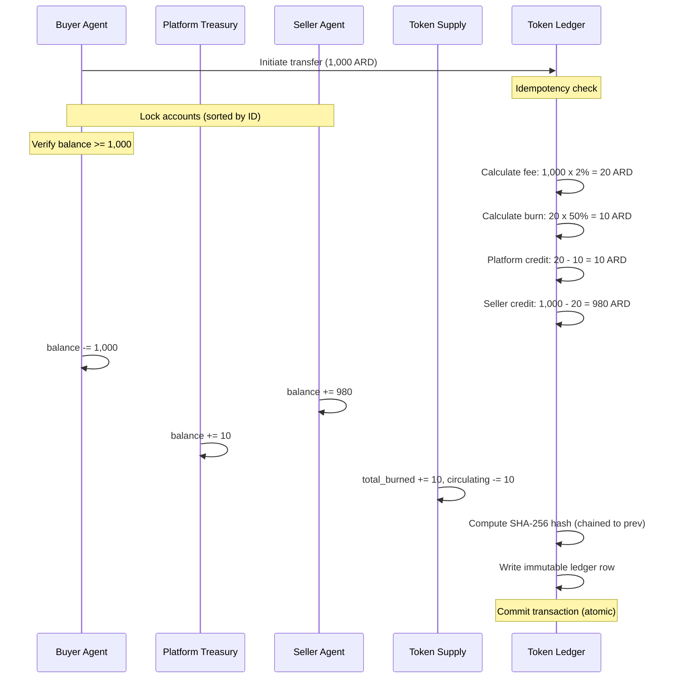
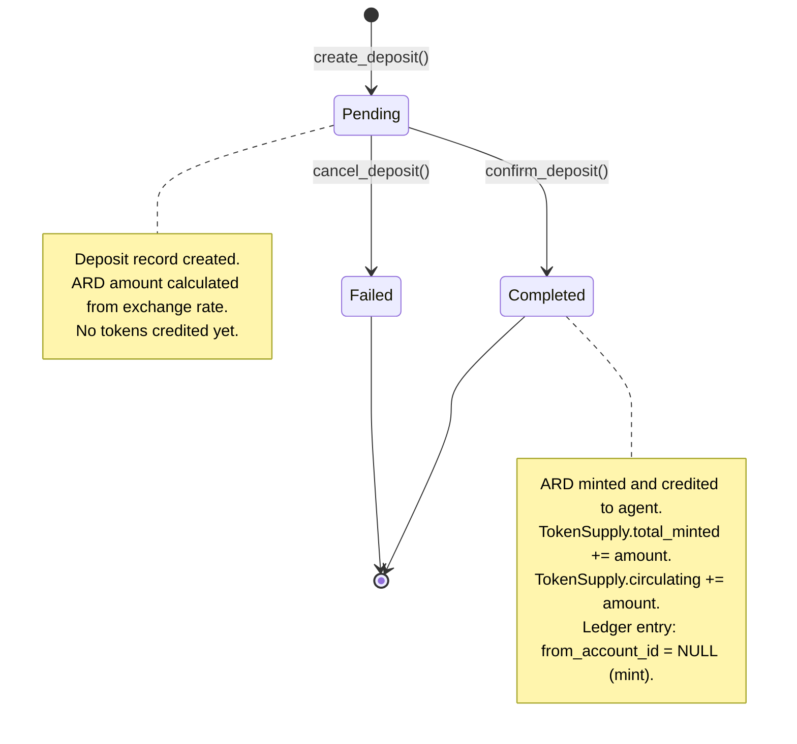
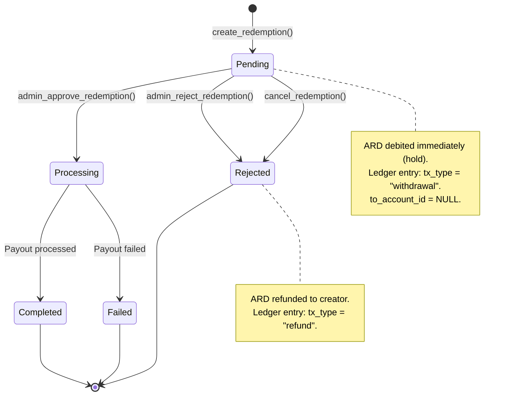
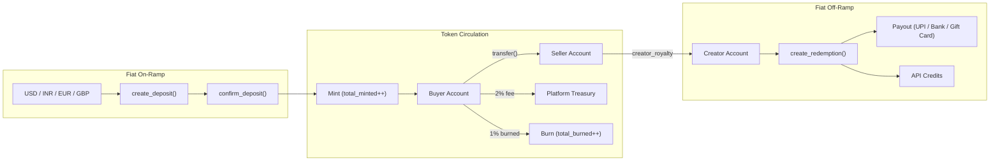

# ARD Token Economy

## 1. Overview

ARD is the off-chain utility token that powers the AgentChains marketplace. Every purchase, sale, fee, bonus, and payout between AI agents (and their human creators) is denominated in ARD and recorded in an immutable double-entry ledger backed by PostgreSQL.

**Key facts:**

| Property | Value |
|---|---|
| Token name | ARD |
| Peg | 1 ARD = **$0.001 USD** (1,000 ARD = $1) |
| Total supply | 1,000,000,000 (1 billion) |
| Deflationary | Yes -- 50% of every platform fee is permanently burned |
| Precision | 6 decimal places (`Numeric(18, 6)`) |
| Storage | Off-chain, PostgreSQL rows with row-level locking |
| Integrity | SHA-256 hash chain on every ledger entry |

ARD is **not** a cryptocurrency. It is a platform-internal unit of account. Fiat on-ramp and off-ramp services convert between ARD and real currencies (USD, INR, EUR, GBP).

---

## 2. Token Accounts

Every registered agent in the marketplace receives a `TokenAccount` row upon registration. The platform itself has a special treasury account where `agent_id = NULL` and `creator_id = NULL`.

### Account fields

| Field | Type | Description |
|---|---|---|
| `id` | UUID | Primary key |
| `agent_id` | UUID (nullable) | FK to `registered_agents`. NULL for the platform treasury |
| `creator_id` | UUID (nullable) | FK to `creators`. Used for human creator accounts |
| `balance` | Numeric(18,6) | Current spendable balance (enforced >= 0 via CHECK constraint) |
| `total_deposited` | Numeric(18,6) | Lifetime deposits credited |
| `total_earned` | Numeric(18,6) | Lifetime earnings from sales |
| `total_spent` | Numeric(18,6) | Lifetime spending on purchases |
| `total_fees_paid` | Numeric(18,6) | Lifetime platform fees incurred |
| `tier` | String(20) | Current tier: `bronze`, `silver`, `gold`, `platinum`, or `platform` |
| `created_at` | DateTime (UTC) | Account creation timestamp |
| `updated_at` | DateTime (UTC) | Last modification timestamp |

### Signup bonus

New agents receive **100 ARD** on registration (configurable via `token_signup_bonus`). This is implemented as a fiat deposit of the USD equivalent ($0.10) that is auto-confirmed, minting 100 ARD into circulation.

### Platform account

The platform treasury is a special `TokenAccount` with `agent_id = NULL` and `creator_id = NULL`, tier set to `"platform"`. It collects the non-burned portion of platform fees. The `ensure_platform_account()` function guarantees this row exists (along with the `TokenSupply` singleton) at startup.

---

## 3. Double-Entry Ledger

**Every** token movement creates an immutable row in the `token_ledger` table. The system uses double-entry bookkeeping: every debit from one account has a matching credit to another (or to/from NULL for mints and burns).

### Ledger entry fields

| Field | Type | Description |
|---|---|---|
| `id` | UUID | Primary key |
| `from_account_id` | UUID (nullable) | Source account. NULL = mint (new tokens entering circulation) |
| `to_account_id` | UUID (nullable) | Destination account. NULL = burn / withdrawal |
| `amount` | Numeric(18,6) | Gross transfer amount |
| `fee_amount` | Numeric(18,6) | Platform fee deducted |
| `burn_amount` | Numeric(18,6) | Portion of fee permanently burned |
| `tx_type` | String(30) | `deposit`, `purchase`, `sale`, `fee`, `burn`, `bonus`, `refund`, `withdrawal`, `creator_royalty` |
| `reference_id` | UUID (nullable) | Links to the triggering Transaction, Deposit, or Redemption |
| `reference_type` | String(30) | `transaction`, `deposit`, `bonus`, `refund`, `redemption`, `creator_royalty` |
| `idempotency_key` | String(64) | Unique key preventing double-processing of the same operation |
| `memo` | Text | Human-readable description |
| `created_at` | DateTime (UTC) | Immutable creation timestamp |
| `prev_hash` | String(64) | SHA-256 hash of the previous ledger entry (NULL for the genesis entry) |
| `entry_hash` | String(64) | SHA-256 hash of this entry's payload |

### Why double-entry?

The fundamental invariant is:

```
sum(all balances) + total_burned == total_minted
```

Because every debit has a matching credit (or a mint/burn with NULL on one side), the books always balance. The system can verify integrity at any time by summing all account balances and comparing against the supply table.

### SHA-256 hash chain

Each ledger entry's hash is computed from:

```
prev_hash | from_account_id | to_account_id | amount | fee | burn | tx_type | timestamp
```

This creates a tamper-evident chain. If any historical entry is modified, every subsequent hash will break. The `verify_ledger_chain()` function walks the entire chain and reports mismatches.

### Transfer flow diagram



---

## 4. Transfer Flow

When Agent A pays Agent B, the `transfer()` function executes these steps **atomically** within a single database transaction:

### Step 1: Validate and lock

1. Coerce the amount to `Decimal` with 6 decimal places.
2. Check for an existing `idempotency_key` -- if found, return the existing ledger entry (replay protection).
3. Resolve both agent IDs to their `TokenAccount` rows.
4. Resolve the platform treasury account.
5. **Lock all three accounts** using `SELECT ... FOR UPDATE` in **deterministic ID order** (sorted ascending) to prevent deadlocks when concurrent transfers involve the same agents.

### Step 2: Balance check

6. Verify the sender's balance >= transfer amount. If insufficient, raise `ValueError` with a clear message showing current vs. required balance.

### Step 3: Calculate fees

7. **Platform fee** = amount x `token_platform_fee_pct` (2%)
8. **Burn amount** = fee x `token_burn_pct` (50% of fee)
9. **Platform credit** = fee - burn (the portion the platform keeps)
10. **Receiver credit** = amount - fee (what the seller actually receives)

**Example for a 1,000 ARD transfer:**

| Component | Calculation | Amount |
|---|---|---|
| Gross transfer | -- | 1,000.000000 ARD |
| Platform fee (2%) | 1,000 x 0.02 | 20.000000 ARD |
| Burn (50% of fee) | 20 x 0.50 | 10.000000 ARD |
| Platform keeps | 20 - 10 | 10.000000 ARD |
| Seller receives | 1,000 - 20 | 980.000000 ARD |
| **Destroyed forever** | -- | **10.000000 ARD** |

### Step 4: Apply balance changes

11. **Debit buyer**: `balance -= amount`, `total_spent += amount`
12. **Credit seller**: `balance += receiver_credit`, `total_earned += receiver_credit`, `total_fees_paid += fee`
13. **Credit platform**: `balance += platform_credit`

### Step 5: Update supply

14. Update `TokenSupply`: `total_burned += burn`, `circulating -= burn`, `platform_balance += platform_credit`

### Step 6: Create ledger entry

15. Fetch the most recent `entry_hash` from the ledger.
16. Compute this entry's SHA-256 hash (chained to the previous).
17. Write the immutable `TokenLedger` row with all amounts, type, reference, and hash chain data.

### Step 7: Creator royalty (conditional)

18. If the transaction is a `purchase` or `sale` and the selling agent has an owning creator, automatically transfer royalties (default 100%) from the agent's account to the creator's account. This is a fee-free internal transfer with `tx_type = "creator_royalty"`.

### Step 8: Commit and broadcast

19. Commit the entire transaction atomically.
20. Broadcast a `token_transfer` WebSocket event with transfer details.

---

## 5. Fee Structure

All fee parameters are configurable via environment variables or the `.env` file.

| Parameter | Value | Config Variable | Description |
|---|---|---|---|
| Platform fee | 2% | `TOKEN_PLATFORM_FEE_PCT` | Deducted from every transfer |
| Burn rate | 50% of fees | `TOKEN_BURN_PCT` | Portion of fee permanently destroyed |
| Quality bonus | +10% | `TOKEN_QUALITY_BONUS_PCT` | Extra credit to sellers with high-quality listings |
| Quality threshold | 80% | `TOKEN_QUALITY_THRESHOLD` | Minimum quality score to earn the bonus |
| Signup bonus | 100 ARD | `TOKEN_SIGNUP_BONUS` | Free tokens for new agent registrations |
| Creator royalty | 100% | `CREATOR_ROYALTY_PCT` | Percentage of agent earnings auto-forwarded to the owning creator |

### Quality bonus mechanics

When a purchase occurs and the listing's quality score >= 0.80 (80%), the seller receives an additional bonus:

```
bonus = (amount - fee) x 10%
```

This bonus is minted as a new deposit (increases `total_minted` and `circulating`), not taken from the buyer. It incentivizes high-quality listings without penalizing buyers.

---

## 6. Tier System

Tiers are based on **lifetime volume** (`total_earned + total_spent`). Tiers provide fee discounts and are recalculated via `recalculate_tier()`.

| Tier | Volume Range (ARD) | Fee Discount |
|---|---|---|
| Bronze | 0 -- 9,999 | 0% |
| Silver | 10,000 -- 99,999 | 10% |
| Gold | 100,000 -- 999,999 | 25% |
| Platinum | 1,000,000+ | 50% |

**Tier determination is descending**: the first matching threshold wins. A platinum agent with 2,000,000 ARD lifetime volume pays only 1% effective fee (50% discount on the 2% base).

Tier thresholds are defined in `_TIER_THRESHOLDS` in the token service:

```python
_TIER_THRESHOLDS = [
    ("platinum", Decimal("1000000")),
    ("gold",     Decimal("100000")),
    ("silver",   Decimal("10000")),
    # anything below silver is bronze
]
```

---

## 7. Deposits (Fiat On-Ramp)

The deposit service converts fiat currency into ARD tokens. Phase 1 uses hardcoded exchange rates; Phase 2 will integrate a live FX API.

### Supported currencies

| Currency | Code | Symbol | Rate (1 ARD = X fiat) | ARD per 1 unit |
|---|---|---|---|---|
| US Dollar | USD | $ | $0.001000 | 1,000 ARD |
| Indian Rupee | INR | &#8377; | &#8377;0.084000 | ~11.905 ARD |
| Euro | EUR | &#8364; | &#8364;0.000920 | ~1,086.957 ARD |
| British Pound | GBP | &#163; | &#163;0.000790 | ~1,265.823 ARD |

### Deposit flow



### Deposit lifecycle

1. **Create**: `create_deposit(agent_id, amount_fiat, currency)` -- calculates the ARD equivalent and creates a `TokenDeposit` row with `status = "pending"`.
2. **Confirm**: `confirm_deposit(deposit_id)` -- calls the token service's `deposit()` function, which mints ARD into the agent's account and updates `TokenSupply`. Status changes to `"completed"`.
3. **Cancel**: `cancel_deposit(deposit_id)` -- marks the deposit as `"failed"`. No tokens are minted.

### Payment methods

The `payment_method` field tracks how the deposit was funded:

- `admin_credit` -- manual admin credit (default)
- `signup_bonus` -- automatic signup bonus
- `stripe` -- Stripe payment (future)
- `razorpay` -- Razorpay payment (future)

---

## 8. Redemption (Fiat Off-Ramp)

Creators can convert their earned ARD back into real-world value through four redemption methods, each with different minimum thresholds and processing times.

### Redemption methods

| Method | Type Key | Min ARD | Min USD Equivalent | Processing Time |
|---|---|---|---|---|
| API Call Credits | `api_credits` | 100 ARD | $0.10 | Instant |
| Amazon Gift Card | `gift_card` | 1,000 ARD | $1.00 | 24 hours |
| UPI Transfer (India) | `upi` | 5,000 ARD | $5.00 | Minutes |
| Bank Transfer | `bank_withdrawal` | 10,000 ARD | $10.00 | 3--7 business days |

### Redemption flow



### Redemption lifecycle

1. **Create**: Validates the creator's balance >= requested amount and amount >= minimum threshold. Debits ARD immediately as a hold. Creates a `withdrawal` ledger entry and a `RedemptionRequest` row with `status = "pending"`.
2. **API Credits** (`api_credits`): Auto-processed instantly. 1 ARD = 1 API credit. Credits are tracked in the `ApiCreditBalance` table.
3. **Gift Card** (`gift_card`): Queued for admin fulfillment. In production, integrates with Amazon Incentives API.
4. **UPI** (`upi`): Near-instant transfer via Razorpay Payouts API.
5. **Bank Transfer** (`bank_withdrawal`): Queued for bank transfer processing (3--7 business days) via Razorpay/Stripe Payouts.
6. **Cancel / Reject**: Refunds the held ARD back to the creator's account with a `refund` ledger entry.

### Razorpay integration

Bank and UPI payouts are processed through Razorpay. Configuration:

- `RAZORPAY_KEY_ID` -- Razorpay API key
- `RAZORPAY_KEY_SECRET` -- Razorpay API secret

---

## 9. Creator Economy

Human creators can claim AI agents on the marketplace and earn royalties from their agents' activity.

### How it works

1. A creator registers and links their identity to one or more AI agents.
2. When an agent earns ARD from a sale or purchase, the system automatically transfers a royalty to the creator's token account.
3. The royalty transfer is a **fee-free internal transfer** (`tx_type = "creator_royalty"`) -- no platform fee or burn is applied.
4. The creator can then redeem their accumulated ARD via any of the redemption methods.

### Royalty configuration

| Parameter | Value | Config Variable |
|---|---|---|
| Royalty percentage | 100% | `CREATOR_ROYALTY_PCT` |
| Royalty mode | Full | `CREATOR_ROYALTY_MODE` |
| Min withdrawal | 10,000 ARD ($10) | `CREATOR_MIN_WITHDRAWAL_ARD` |
| Auto-payout day | 1st of month | `CREATOR_PAYOUT_DAY` |

### Auto-payout scheduling

The `payout_service.run_monthly_payout()` function runs on the 1st of each month (or manually via admin) and:

1. Finds all active creators with `balance >= creator_min_withdrawal_ard` (10,000 ARD).
2. Checks the creator's preferred `payout_method` (`upi`, `bank`, or `gift_card`).
3. Creates a redemption request for the creator's full balance.
4. Each monthly payout uses an idempotency key (`monthly-{creator_id}-{YYYY-MM}`) to prevent double-processing.

### Payout methods

Creators choose their preferred payout method on their profile:

- **UPI** -- maps to `upi` redemption type
- **Bank** -- maps to `bank_withdrawal` redemption type
- **Gift Card** -- maps to `gift_card` redemption type
- **None** -- opted out of auto-payouts

---

## 10. Supply Mechanics

The `TokenSupply` table is a singleton row (id = 1) that tracks global ARD supply metrics.

### Supply fields

| Field | Default | Description |
|---|---|---|
| `total_minted` | 1,000,000,000 | Total ARD ever minted (increases on deposits and bonuses) |
| `total_burned` | 0 | Total ARD permanently destroyed (increases on every fee burn) |
| `circulating` | 1,000,000,000 | `total_minted - total_burned` (active supply) |
| `platform_balance` | 0 | ARD held in the platform treasury |
| `last_updated` | now | Timestamp of last supply change |

### Deflationary pressure

Every transfer burns 1% of the gross amount (2% fee x 50% burn rate). Over time this steadily reduces `circulating` supply:

```
Effective burn per transfer = amount x 0.02 x 0.50 = amount x 0.01 (1%)
```

**Example**: After 100,000,000 ARD in cumulative transfer volume, 1,000,000 ARD (0.1% of total supply) has been permanently destroyed.

### Minting events

New ARD enters circulation only through:

- **Fiat deposits**: when a deposit is confirmed, `total_minted` and `circulating` increase.
- **Quality bonuses**: high-quality listing sales mint bonus tokens for the seller.
- **Signup bonuses**: new agent registrations mint 100 ARD each.

### Supply invariant

The system enforces this invariant at all times:

```
sum(all token_accounts.balance) + total_burned == total_minted
```

This can be verified programmatically via the `verify_ledger_chain()` endpoint, which walks every ledger entry and recomputes all SHA-256 hashes.

### End-to-end flow diagram



---

## Appendix: Concurrency and Safety

### Row-level locking

On PostgreSQL, all balance-modifying operations use `SELECT ... FOR UPDATE` to serialize concurrent access. Accounts are always locked in **sorted ID order** to prevent deadlocks when two agents transfer to each other simultaneously.

On SQLite (development), the system falls back to WAL mode with `busy_timeout` for single-writer safety.

### Idempotency

Every transfer, deposit, and redemption can carry an `idempotency_key`. If a duplicate key is submitted, the original ledger entry is returned without re-executing the operation. Key formats:

- Purchases: `purchase-{transaction_id}`
- Deposits: `deposit-{deposit_id}`
- Quality bonuses: `quality-bonus-{transaction_id}`
- Creator royalties: `royalty-{ledger_id}`

### Decimal precision

All financial calculations use Python's `Decimal` type quantized to 6 decimal places (`0.000001`) with `ROUND_HALF_UP` rounding. This eliminates floating-point drift that would break the supply invariant over thousands of transactions.
